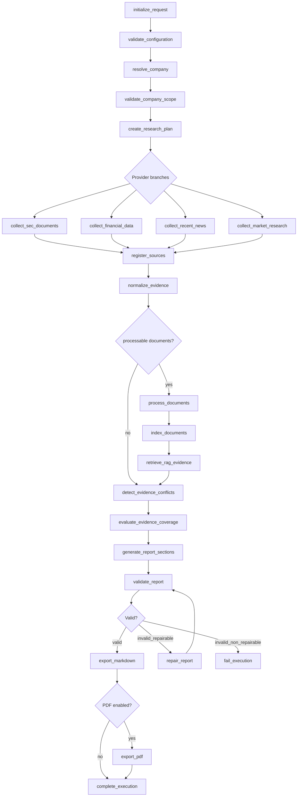

# Developer Implementation Specification

**Project:** Autonomous Company Research and Executive Report Generation Agent  
**Working Name:** Company Intelligence Agent  
**Repository:** `autonomous-company-research-agent`  
**Document Version:** 1.0  
**Status:** Approved for Implementation  
**Parent Document:** `docs/TECHNICAL_SOLUTION_BLUEPRINT.md`  
**Primary Audience:** Developers, technical reviewers, AI coding agents, and Ironhack evaluators  
**Last Updated:** 2026-07-18

## 1. Document Purpose and Authority

### 1.1 Purpose

This specification translates the approved Blueprint into implementation rules for developers and AI coding agents. It defines how the repository MUST be built, in which order work MUST proceed, which interfaces are canonical, and which implementation decisions are frozen.

### 1.2 Authority

The architectural source of truth is `docs/TECHNICAL_SOLUTION_BLUEPRINT.md`. This specification is subordinate to the Blueprint and MUST remain fully compatible with it.

### 1.3 Precedence Hierarchy

The precedence order is:

1. Blueprint.
2. This implementation specification.
3. Phase-level implementation notes.
4. Local code comments and work-in-progress notes.

If any instruction conflicts with the Blueprint, the Blueprint wins.

### 1.4 Audience

The intended audience is developers, AI coding agents, technical reviewers, and Ironhack evaluators.

### 1.5 Scope

This document covers implementation ordering, repository layout, module responsibilities, interfaces, state ownership, testing expectations, and delivery gates for the approved MVP.

### 1.6 Out of Scope

This document MUST NOT introduce new product scope, new nodes, new providers, new state fields, new model names, or new repository capabilities beyond the Blueprint.

### 1.7 Normative Language

MUST, MUST NOT, SHOULD, SHOULD NOT, and MAY are used with RFC-style meaning.

### 1.8 Maintenance Rules

This document MAY be refined only when the Blueprint changes or when implementation details need clarification without changing architecture. Any change that affects scope or workflow semantics MUST first be reflected in the Blueprint.

## 2. Implementation Governance

### 2.1 Architecture Preservation

Implementation MUST preserve the Blueprint architecture. Nodes, state, provider hierarchy, source hierarchy, report structure, and repository structure MUST remain compatible.

### 2.2 No-Scope-Expansion Rule

Implementation MUST NOT expand the MVP. If a requirement is not in the Blueprint, it MUST be treated as out of scope unless a Blueprint revision explicitly approves it.

### 2.3 Change Classification

Changes are classified as:

- Conforming: aligned with the Blueprint and this specification.
- Clarifying: narrows ambiguity without altering scope.
- Deferred: postponed until a later phase.
- Blocked: cannot proceed because a prerequisite is missing.
- Non-conforming: contradicts the Blueprint.

### 2.4 Change Control

Every change SHOULD be small, reviewable, and test-backed. A change that affects architecture, routing, or canonical contracts MUST be reviewed against the Blueprint before implementation.

### 2.5 Decision Hierarchy

Implementation decisions MUST follow this order:

1. Blueprint requirements.
2. This specification.
3. Existing canonical interfaces and models.
4. Local implementation details.

### 2.6 Incremental Implementation

Work MUST be delivered in small increments. Each increment SHOULD leave the repository in a runnable or testable state.

### 2.7 Stop Conditions

Implementation MUST stop and request clarification when a change would contradict the Blueprint, require new scope, or force ambiguous architectural choices that affect canonical contracts.

### 2.8 Documentation Synchronization

Implementation code, tests, and documentation SHOULD be synchronized within the same phase. Documentation MUST be updated when implementation behavior changes.

## 3. Technology and Dependency Baseline

### 3.1 Python Runtime

The implementation target is Python 3.11 or newer. Code MUST remain compatible with the Python version available in the project environment.

### 3.2 Synchronous-First Policy

The MVP MUST use synchronous LangGraph nodes. Async nodes and async provider clients are outside the initial MVP and MUST NOT be mixed with synchronous implementations in the first release. A future async migration requires a documented implementation revision.

### 3.3 Core Frameworks

The approved stack is:

- Python
- LangGraph
- LangChain
- Pinecone
- httpx
- Markdown as the canonical report format
- PDF as a derived artifact
- environment-variable-based configuration
- pytest for automated testing

### 3.4 HTTP Client Policy

All provider calls MUST be isolated inside client modules. Graph nodes, services, exporters, and prompts MUST NOT perform direct network calls. Provider HTTP clients MUST use `httpx.Client`. The same synchronous transport approach SHOULD be used consistently within each provider client.

### 3.5 Model Validation

All canonical models MUST be validated at the boundary where they are created or transformed. Validation MUST prevent malformed company identities, invalid report metadata, inconsistent state shapes, and unsupported identifiers from entering the workflow.

### 3.6 Dependency Management

The repository MUST keep `requirements.txt` as the dependency-management direction for the MVP. New direct dependencies MUST be added only when a phase requires them.

### 3.7 Dependency Approval

A new dependency MUST be approved only when:

- it is required by the Blueprint or by an implementation decision already aligned with the Blueprint;
- it is used in a single responsibility layer;
- it does not introduce unnecessary infrastructure.

### 3.8 Version Policy

Direct runtime dependencies SHOULD be pinned or tightly constrained. Version upgrades MUST be reviewed for compatibility with the Blueprint and the current implementation stage.

### 3.9 Prohibited Infrastructure

The implementation MUST NOT introduce Docker, Kubernetes, distributed queues, microservices, enterprise secret managers, relational application databases, frontend frameworks, authentication, or scheduling.

## 4. Target Repository Implementation Map

### 4.1 Repository Structure

The target implementation structure is:

```text
autonomous-company-research-agent/
|-- app/
|   |-- __init__.py
|   |-- main.py
|   |-- settings.py
|   |-- models/
|   |   `-- state.py
|   |-- config/
|   |   |-- defaults.py
|   |   `-- constants.py
|   |-- clients/
|   |-- services/
|   |-- rag/
|   |-- prompts/
|   |-- exporters/
|   |-- graph/
|   |-- nodes/
|   `-- utils/
|-- tests/
|   |-- unit/
|   |-- integration/
|   |-- e2e/
|   `-- fixtures/
|-- docs/
|   |-- TECHNICAL_SOLUTION_BLUEPRINT.md
|   `-- DEVELOPER_IMPLEMENTATION_SPECIFICATION.md
|-- data/
|   |-- raw/
|   |-- processed/
|   `-- cache/
|-- outputs/
|-- .env.example
|-- .gitignore
|-- requirements.txt
|-- README.md
`-- lab_summary.md
```

### 4.2 Directory Responsibilities

| Directory | Responsibility |
|---|---|
| `app/` | Application package and runtime entry points. |
| `app/settings.py` | Sole environment configuration boundary. |
| `app/models/state.py` | Canonical shared state contract. |
| `app/config/` | Non-secret defaults, constants, and runtime mapping helpers. |
| `app/clients/` | Provider clients and transport boundaries. |
| `app/services/` | Reusable domain logic. |
| `app/rag/` | Chunking, embedding, retrieval, and evidence conversion support. |
| `app/prompts/` | Versioned prompt templates and rendering metadata. |
| `app/exporters/` | Markdown and PDF export. |
| `app/graph/` | LangGraph builder and routing functions. |
| `app/nodes/` | Canonical workflow nodes. |
| `app/utils/` | Small generic utilities. |
| `tests/` | Unit, integration, and end-to-end tests. |
| `docs/` | Architecture and implementation documentation. |
| `data/` | Raw, processed, and cache storage. |
| `outputs/` | Generated Markdown, PDF, and other approved artifacts. |

### 4.3 Creation Order

Creation SHOULD follow the implementation sequence:

1. `app/settings.py` and `app/config/`.
2. `app/models/`.
3. `app/utils/`.
4. `app/clients/`.
5. `app/services/`.
6. `app/rag/`.
7. `app/prompts/`.
8. `app/exporters/`.
9. `app/nodes/`.
10. `app/graph/`.
11. `app/main.py`.
12. `tests/`.
13. Documentation synchronization.

### 4.4 Package Rules

Each package MUST expose a small, explicit public surface. `__init__.py` files SHOULD remain minimal and MAY export only canonical entry points where that improves import stability.

### 4.5 Dependency Direction

The dependency direction is:

- Entry boundary depends on graph and application services.
- Graph depends on nodes and state models.
- Nodes depend on services, models, prompts, and RAG interfaces.
- Services depend on clients, models, and utilities.
- Clients depend on centralized configuration and transport utilities.
- RAG depends on models, clients, and utilities.
- Exporters depend on accepted report models and utilities.
- Models MUST remain independent of application orchestration.

```mermaid
flowchart LR
    entry[Entry boundary] --> graph[Graph]
    entry --> app_services[Application services]
    graph --> nodes[Nodes]
    graph --> state[State models]
    nodes --> services[Services]
    nodes --> models[Models]
    nodes --> prompts[Prompts]
    nodes --> rag[RAG interfaces]
    services --> clients[Clients]
    services --> models
    services --> utils[Utilities]
    clients --> config[Centralized config]
    clients --> transport[Transport utilities]
    rag --> models
    rag --> clients
    rag --> utils
    exporters[Exporters] --> accepted[Accepted report models]
    exporters --> utils
```

### 4.6 Import Rules

Imports MUST remain acyclic where practical. Cross-layer imports SHOULD flow downward only. A higher layer MUST NOT import implementation details from a lower layer if that creates a circular dependency.

### 4.7 Circular Dependency Prevention

Circular dependencies MUST be prevented by:

- extracting reusable logic into services or utilities;
- keeping models free of orchestration logic;
- moving transport code into clients;
- keeping prompts data-only;
- using interfaces or factory functions for wiring.

### 4.8 Public Package Interfaces

Public package interfaces SHOULD be limited to:

- `app.main.main()`
- `app.settings.load_settings()`
- `app.models.state.CompanyResearchState`
- graph builder entry points
- canonical client constructors
- reusable service functions

## 5. File and Interface Inventory

### 5.1 Inventory Rules

The table below lists the approved implementation files. New files MAY be added only when they belong to an approved layer and have a clear consumer.

| File | Purpose | Public Interfaces | Dependencies | Consumers | Stage | Testing Scope | Prohibited Responsibilities |
|---|---|---|---|---|---|---|---|
| `app/main.py` | CLI entry boundary and compiled-graph invocation. | `main() -> None`. | `app.settings`, `app.graph.builder`. | CLI users, tests. | Foundation. | Smoke and CLI wiring tests. | Provider logic, report generation, file export rules. |
| `app/settings.py` | Sole environment configuration boundary. | `Settings`, `load_settings()`. | `os`, `dotenv`. | Clients, services, graph wiring. | Foundation. | Configuration loading tests. | Graph routing, provider calls, secret printing. |
| `app/config/defaults.py` | Non-secret runtime defaults. | Constants and default factories. | Standard library only. | Settings mapping, graph wiring. | Foundation. | Constant integrity tests. | Secrets, provider calls, graph routing. |
| `app/config/constants.py` | Approved symbolic constants. | Canonical constant values. | Standard library only. | Settings mapping, services, graph. | Foundation. | Constant integrity tests. | Secrets, provider calls, graph routing. |
| `app/models/execution.py` | Execution metadata models. | `ExecutionContext`, `ExecutionResult`. | Standard library validation. | Services, graph, tests. | Phase 1. | Unit tests for status rules. | Provider transport, graph routing. |
| `app/models/request.py` | User request model. | `ResearchRequest`. | Standard library validation. | Settings mapping, graph entry. | Phase 1. | Request validation tests. | Provider calls, export logic. |
| `app/models/company.py` | Company identity models. | `ResolvedCompany`. | Standard library validation. | Services, nodes, tests. | Phase 1. | Identity and scope tests. | Network calls, report synthesis. |
| `app/models/research.py` | Research planning models. | `ResearchTask`, `ResearchPlan`. | Standard library validation. | Planning service, nodes. | Phase 1. | Planning contract tests. | Provider access, export logic. |
| `app/models/documents.py` | Document lineage models. | `DocumentRecord`. | Standard library validation. | RAG, services, nodes. | Phase 1. | Document metadata tests. | Raw file IO, graph routing. |
| `app/models/sources.py` | Source lineage models. | `SourceRecord`. | Standard library validation. | Registration, lineage, tests. | Phase 1. | Provenance tests. | Provider discovery, export logic. |
| `app/models/evidence.py` | Evidence and conflict models. | `EvidenceRecord`, `RejectedEvidenceRecord`, `EvidenceConflict`, `EvidenceCoverage`. | Standard library validation. | Normalization, coverage, graph. | Phase 1. | Evidence semantics tests. | Direct provider transport. |
| `app/models/providers.py` | Provider-domain record models. | `FinancialMetric`, `NewsEvent`, `MarketFinding`, `RAGResult`. | Standard library validation. | Clients, services, nodes. | Phase 1. | Provider payload tests. | Orchestration, export logic. |
| `app/models/report.py` | Report and validation models. | `ReportSection`, `ReportValidationResult`. | Standard library validation. | Report services, exporters. | Phase 1. | Report structure tests. | Provider calls, graph routing. |
| `app/models/state.py` | Canonical shared state contract. | `CompanyResearchState`. | `TypedDict`, canonical models. | Graph, nodes, tests. | Phase 1. | State-shape and reducer tests. | Mutable orchestration logic. |
| `app/clients/sec_client.py` | SEC collection client. | SEC client constructor and fetch methods. | `httpx.Client`, config, models. | Services, nodes. | Phase 2. | Mocked client and live-marker tests. | Graph routing, report synthesis. |
| `app/clients/alpha_vantage_client.py` | Financial provider client. | Alpha Vantage client constructor and fetch methods. | `httpx.Client`, config, models. | Services, nodes. | Phase 2. | Mocked client and live-marker tests. | Graph routing, report synthesis. |
| `app/clients/newsapi_client.py` | News provider client. | NewsAPI client constructor and fetch methods. | `httpx.Client`, config, models. | Services, nodes. | Phase 2. | Mocked client and live-marker tests. | Graph routing, report synthesis. |
| `app/clients/tavily_client.py` | Market research client. | Tavily client constructor and fetch methods. | `httpx.Client`, config, models. | Services, nodes. | Phase 2. | Mocked client and live-marker tests. | Graph routing, report synthesis. |
| `app/clients/pinecone_client.py` | Vector store client. | Pinecone client constructor and retrieval/upsert methods. | `httpx.Client`, config, models. | RAG service, nodes. | Phase 2. | Mocked client and isolation tests. | Report generation, provider discovery. |
| `app/clients/llm_client.py` | LLM invocation client. | Prompt execution methods. | `httpx.Client`, config, models. | Report services, repair service. | Phase 2. | Mocked prompt-execution tests. | Direct state mutation, export logic. |
| `app/clients/embedding_client.py` | Embedding client. | Embedding generation methods. | `httpx.Client`, config, models. | RAG service. | Phase 2. | Mocked embedding tests. | Report synthesis, graph routing. |
| `app/services/company_resolution_service.py` | Resolve company identity and scope. | Resolution functions. | Clients, models, utilities. | Nodes, tests. | Phase 3. | Identity and scope tests. | Report generation, export logic. |
| `app/services/research_planning_service.py` | Build the research plan. | Planning functions. | Models, utilities. | Nodes, graph. | Phase 3. | Planning tests. | Provider transport, export logic. |
| `app/services/source_registration_service.py` | Register canonical sources. | Registration functions. | Models, utilities. | Nodes, lineage tests. | Phase 3. | Provenance tests. | Evidence synthesis, export logic. |
| `app/services/document_processing_service.py` | Extract, clean, and prepare documents. | Document processing functions. | RAG helpers, models. | Nodes, RAG. | Phase 3. | Extraction and cleaning tests. | Source discovery, report synthesis. |
| `app/services/evidence_normalization_service.py` | Convert structured provider output to canonical evidence. | Normalization functions. | Models, utilities. | Nodes, coverage tests. | Phase 3. | Normalization tests. | Report export, graph routing. |
| `app/services/evidence_deduplication_service.py` | Remove duplicate evidence. | Deduplication functions. | Models, utilities. | Nodes, report services. | Phase 3. | Deduplication tests. | Provider calls, export logic. |
| `app/services/evidence_conflict_service.py` | Detect and classify evidence conflicts. | Conflict functions. | Models, utilities. | Nodes, coverage services. | Phase 3. | Conflict tests. | Provider discovery, export logic. |
| `app/services/evidence_coverage_service.py` | Evaluate report coverage. | Coverage functions. | Models, report spec. | Nodes, validation. | Phase 3. | Coverage tests. | Provider calls, export logic. |
| `app/services/report_generation_service.py` | Assemble grounded report sections. | Generation functions. | Models, prompts. | Nodes, exporters. | Phase 4. | Report-assembly tests. | Provider discovery, file export. |
| `app/services/report_validation_service.py` | Validate report quality and repairability. | Validation functions. | Models, report spec. | Nodes, graph. | Phase 4. | Validation and repairability tests. | Creating new evidence, export logic. |
| `app/services/report_repair_service.py` | Repair invalid report sections. | Repair functions. | Models, prompts, validation service. | Nodes, graph. | Phase 4. | Bounded-repair tests. | New evidence creation, provider discovery. |
| `app/services/artifact_service.py` | Register artifacts and checksums. | Artifact functions. | Models, utilities, exporters. | Nodes, tests. | Phase 4. | Artifact registration tests. | Report synthesis, provider calls. |
| `app/rag/extraction.py` | Extract raw text from documents. | Extraction helpers. | Models, utilities. | Document processing service. | Phase 3. | Extraction tests. | Provider discovery, report generation. |
| `app/rag/cleaning.py` | Clean extracted text. | Cleaning helpers. | Models, utilities. | Document processing service. | Phase 3. | Cleaning tests. | Provider discovery, report generation. |
| `app/rag/chunking.py` | Split documents into retrievable chunks. | Chunking helpers. | Models, utilities. | Indexing and retrieval. | Phase 3. | Chunking tests. | Provider discovery, report generation. |
| `app/rag/indexing.py` | Prepare and upsert embeddings. | Indexing helpers. | Clients, models, utilities. | RAG service, nodes. | Phase 3. | Indexing and namespace tests. | Report synthesis, provider discovery. |
| `app/rag/retrieval.py` | Retrieve company-scoped chunks. | Retrieval helpers. | Clients, models, utilities. | RAG service. | Phase 3. | Retrieval and isolation tests. | Report synthesis, provider discovery. |
| `app/rag/evidence_conversion.py` | Convert retrieval output to canonical evidence. | Evidence conversion helpers. | Models, utilities. | RAG service, nodes. | Phase 3. | Conversion tests. | Provider discovery, export logic. |
| `app/graph/builder.py` | Build the compiled LangGraph workflow. | Graph factory and compile helpers. | Nodes, state, routing. | `app.main`. | Phase 4. | Graph wiring and compilation tests. | Provider transport, export logic. |
| `app/graph/routing.py` | Pure routing decisions. | Routing functions. | State, constants. | Graph builder. | Phase 4. | Routing and terminal-branch tests. | Provider calls, file writes. |
| `app/graph/reducers.py` | Shared-state reducer rules. | Reducer helpers. | State, models. | Graph builder, tests. | Phase 4. | Reducer semantics tests. | Routing, provider calls. |
| `app/prompts/report_generation.py` | Report generation prompt template. | Template constants and render metadata. | Models, utilities. | Report generation service. | Phase 3. | Prompt contract tests. | LLM invocation, state mutation. |
| `app/prompts/report_validation.py` | Report validation prompt template. | Template constants and render metadata. | Models, utilities. | Validation service. | Phase 3. | Prompt contract tests. | LLM invocation, state mutation. |
| `app/prompts/report_repair.py` | Report repair prompt template. | Template constants and render metadata. | Models, utilities. | Repair service. | Phase 3. | Prompt contract tests. | LLM invocation, state mutation. |
| `app/prompts/evidence_analysis.py` | Evidence-analysis prompt template. | Template constants and render metadata. | Models, utilities. | Evidence services. | Phase 3. | Prompt contract tests. | LLM invocation, state mutation. |
| `app/exporters/markdown_exporter.py` | Render canonical Markdown report. | Markdown export function. | Models, utilities. | Entry boundary, tests. | Phase 5. | Markdown export tests. | Report synthesis, provider calls. |
| `app/exporters/pdf_exporter.py` | Derive PDF from accepted Markdown. | PDF export function. | Models, utilities, renderer integration. | Entry boundary, tests. | Phase 5. | PDF fallback and failure tests. | Report synthesis, provider calls. |
| `app/utils/ids.py` | Stable identifier helpers. | ID generation helpers. | Standard library only. | Models, services, tests. | Phase 1. | Deterministic ID tests. | Provider calls, graph routing. |
| `app/utils/dates.py` | Date normalization helpers. | Date parsing helpers. | Standard library only. | Models, services, tests. | Phase 1. | Date normalization tests. | Provider calls, graph routing. |
| `app/utils/hashing.py` | Hash and checksum helpers. | Hash helpers. | Standard library only. | Artifact service, tests. | Phase 1. | Hash integrity tests. | Provider calls, graph routing. |
| `app/utils/files.py` | Safe file and path helpers. | Safe file helpers. | Standard library only. | Exporters, artifact service. | Phase 1. | Safe-I/O tests. | Provider calls, graph routing. |
| `app/utils/logging.py` | Logging helpers and redaction. | Logging helpers. | Standard library only. | All layers. | Phase 1. | Redaction and structured-log tests. | Provider calls, graph routing. |
| `tests/unit/*` | Fast isolated tests. | Test modules only. | Mocks, fixtures. | Local runs and CI. | All phases. | Unit scope. | Live network calls. |
| `tests/integration/*` | Integration tests. | Test modules only. | Fixtures, optional live credentials. | Evaluation runs. | All phases. | Integration scope. | Unbounded network calls by default. |
| `tests/e2e/*` | End-to-end tests. | Test modules only. | Fixtures, sample inputs. | Evaluations and hardening. | Later phases. | Full pipeline scope. | Secret fixtures. |
| `tests/fixtures/*` | Shared deterministic fixtures. | Fixture data only. | Canonical sample payloads. | All tests. | All phases. | Fixture integrity tests where needed. | Secrets, live credentials. |

### 5.2 Interface Boundary Rules

Every file MUST have one primary responsibility. Public interfaces MUST be documented with type hints and concise docstrings when the contract is not obvious from the name.

### 5.3 Testing Expectations

Files that wrap providers, graph routing, or export logic MUST have direct tests. Pure models and utilities SHOULD have unit tests. Entry points MUST have smoke coverage.

## 6. Configuration Implementation Specification

### 6.1 Configuration Boundary

`app/settings.py` is the configuration boundary. Other modules MUST NOT read environment variables directly.

### 6.2 `app/settings.py`

`app/settings.py` MUST:

- import `os`, `dataclass`, and `load_dotenv`;
- define an immutable `Settings` dataclass;
- load local `.env` values;
- return a `Settings` instance from `load_settings()`.

### 6.3 Configuration Loading

`load_settings()` MUST call `load_dotenv()` before reading environment variables. Missing values MUST be allowed at this stage.

### 6.4 Settings Model

The `Settings` model MUST keep the canonical optional fields:

- `openai_api_key`
- `pinecone_api_key`
- `pinecone_index_name`
- `tavily_api_key`
- `news_api_key`
- `alpha_vantage_api_key`

### 6.5 RuntimeConfig Mapping

`RuntimeConfig` MUST be derived from `Settings` plus non-secret runtime defaults such as retry limits, timeout values, output paths, and feature flags.

### 6.6 Environment Variables

The canonical `.env` inventory is:

- `OPENAI_API_KEY`
- `PINECONE_API_KEY`
- `PINECONE_INDEX_NAME`
- `TAVILY_API_KEY`
- `NEWS_API_KEY`
- `ALPHA_VANTAGE_API_KEY`

Additional non-secret runtime values MAY be added later if they are documented in `.env.example` and mapped through `RuntimeConfig`.

### 6.7 Provider Flags

Configuration SHOULD expose explicit flags for optional providers and output preferences. Provider flags MUST default to safe, non-blocking values.

### 6.8 Defaults

Defaults MUST be conservative:

- optional providers disabled unless enabled;
- bounded timeouts;
- bounded retries;
- safe output directories;
- no secrets printed or logged.

### 6.9 Validation

Validation MUST confirm the presence of required settings when a provider or feature is enabled. Optional providers MUST fail softly at validation time if disabled or unavailable.

### 6.10 Configuration Testing

Tests SHOULD verify:

- `.env` loading works;
- missing optional values do not fail loading;
- runtime mapping is deterministic;
- required values fail only when the relevant provider is enabled.

## 7. Canonical Model Implementation Specification

### 7.1 Model Strategy

Canonical models MUST be the single source of truth for data shapes that cross module boundaries. Internal implementation models MAY exist, but they MUST not rename canonical concepts.

### 7.2 Canonical Model Inventory

The canonical model inventory is:

- `ExecutionContext`
- `ResearchRequest`
- `RuntimeConfig`
- `ResolvedCompany`
- `ResearchTask`
- `ResearchPlan`
- `DocumentRecord`
- `SourceRecord`
- `EvidenceRecord`
- `RejectedEvidenceRecord`
- `FinancialMetric`
- `NewsEvent`
- `MarketFinding`
- `RAGResult`
- `EvidenceConflict`
- `EvidenceCoverage`
- `ReportSection`
- `ReportValidationResult`
- `WorkflowWarning`
- `WorkflowError`
- `NodeExecutionRecord`
- `ArtifactRecord`
- `ExecutionResult`
- `CompanyResearchState`

### 7.3 Model Groups

| Group | Models |
|---|---|
| Execution | `ExecutionContext`, `ResearchRequest`, `RuntimeConfig`, `ExecutionResult` |
| Company and planning | `ResolvedCompany`, `ResearchTask`, `ResearchPlan` |
| Documents and provenance | `DocumentRecord`, `SourceRecord` |
| Evidence and retrieval | `EvidenceRecord`, `RejectedEvidenceRecord`, `FinancialMetric`, `NewsEvent`, `MarketFinding`, `RAGResult`, `EvidenceConflict`, `EvidenceCoverage` |
| Reporting | `ReportSection`, `ReportValidationResult` |
| Observability | `WorkflowWarning`, `WorkflowError`, `NodeExecutionRecord`, `ArtifactRecord` |
| Shared state | `CompanyResearchState` |

### 7.4 Model Contracts

Models MUST:

- use clear field names;
- validate required identifiers;
- preserve source and company identity;
- preserve period and currency context;
- support JSON-friendly serialization when needed.

### 7.5 Validation

Validation MUST reject invalid company identifiers, inconsistent periods, unsupported currencies, malformed report sections, and invalid execution metadata.

### 7.6 Serialization

Canonical models SHOULD serialize to JSON-compatible structures without custom transport-only objects. Non-serializable provider objects MUST remain outside canonical models.

### 7.7 Identifier Rules

Identifiers SHOULD be stable and explicit. When available, models MUST preserve:

- company ID;
- ticker;
- CIK;
- source ID;
- document ID;
- filing accession number;
- execution ID;
- artifact ID.

### 7.8 Currency Rules

Financial values MUST preserve currency and units. Calculated values MUST be marked as calculated. Report text MUST not silently mix currencies.

### 7.9 Date Rules

Dates SHOULD be normalized to ISO 8601. Timestamps SHOULD use UTC. Financial periods MUST preserve their original reporting period.

### 7.10 Internal Implementation Models

Internal models MAY be used for provider payload normalization, chunk metadata, and transport helpers. Internal models MUST remain hidden behind services or clients and MUST not replace canonical models.

### 7.11 Prohibited Model Content

Models MUST NOT contain:

- API keys or secrets;
- provider SDK objects;
- open network connections;
- file handles;
- graph routing logic;
- prompt templates.

## 8. Shared State Implementation Contract

### 8.1 Initialization

`CompanyResearchState` MUST be initialized with safe defaults and a version field. `initialize_request` MUST seed the replace fields and initialize every collection with a safe empty value. Shared state MUST remain small enough for checkpointing and replay.

### 8.2 Exact Field Inventory

The exact shared state fields are:

- `state_version`
- `execution_context`
- `request`
- `runtime_config`
- `resolved_company`
- `research_plan`
- `documents`
- `sources`
- `evidence`
- `rejected_evidence`
- `financial_metrics`
- `news_events`
- `market_findings`
- `rag_results`
- `evidence_conflicts`
- `evidence_coverage`
- `report_sections`
- `report_validation`
- `warnings`
- `errors`
- `node_execution_records`
- `retry_counters`
- `artifacts`
- `final_result`

### 8.3 Ownership

Each field MUST have a clear owner. Nodes MAY read upstream values but SHOULD only write fields they own. The operation category for every field MUST be explicit.

### 8.4 Read/Write Matrix

| Field | Primary node | Operation | Notes |
|---|---|---|---|
| `state_version` | `initialize_request` | Replace | Stable workflow version marker. |
| `execution_context` | `initialize_request` | Replace | Execution metadata seed. |
| `request` | `initialize_request` | Replace | Normalized request model. |
| `runtime_config` | `validate_configuration` | Replace | Derived from settings and defaults. |
| `resolved_company` | `resolve_company`, `validate_company_scope` | Replace | One company per execution. |
| `research_plan` | `create_research_plan` | Replace | Canonical plan for collection and synthesis. |
| `documents` | `collect_sec_documents`, `process_documents`, `index_documents` | Upsert | Stable by document ID. |
| `sources` | `register_sources` | Upsert | Stable by source ID. |
| `evidence` | `normalize_evidence`, `retrieve_rag_evidence` | Append | Accepted evidence records. |
| `rejected_evidence` | `normalize_evidence`, `retrieve_rag_evidence` | Append | Rejected evidence records. |
| `financial_metrics` | `collect_financial_data` | Append | Structured financial provider records. |
| `news_events` | `collect_recent_news` | Append | Structured news provider records. |
| `market_findings` | `collect_market_research` | Append | Structured market research records. |
| `rag_results` | `retrieve_rag_evidence` | Append | Retrieval candidates and validation outcomes. |
| `evidence_conflicts` | `detect_evidence_conflicts` | Append | Conflict records are additive. |
| `evidence_coverage` | `evaluate_evidence_coverage` | Replace | Coverage is a deterministic decision object. |
| `report_sections` | `generate_report_sections`, `repair_report` | Upsert | Stable by section ID. |
| `report_validation` | `validate_report` | Replace | Latest validation verdict only. |
| `warnings` | Multiple nodes | Append | Non-fatal workflow observations. |
| `errors` | Multiple nodes | Append | Safe failure or validation messages. |
| `node_execution_records` | All nodes | Append | One record per node execution event. |
| `retry_counters` | Graph builder and repair loop | Counter update | Keyed by node name or repair loop. |
| `artifacts` | `export_markdown`, `export_pdf` | Append | Artifact records are accumulated. |
| `final_result` | `complete_execution`, `fail_execution` | Replace | Terminal execution result only. |

### 8.5 Reducers

Reducers MUST preserve the operation categories above. Append collections MUST accumulate deterministically. Replace fields MUST overwrite the prior value. Upsert collections MUST merge by stable identifier without creating duplicates. Counter updates MUST remain keyed and bounded.

### 8.6 Replace, Append, and Upsert Rules

- `state_version`, `execution_context`, and `request` are replaced by `initialize_request`.
- `documents` are created or upserted by `collect_sec_documents`, `process_documents`, and `index_documents`.
- `sources` are created or upserted by `register_sources`.
- `generate_report_sections` and `repair_report` MUST upsert report sections by section ID.
- `evaluate_evidence_coverage` MUST replace `evidence_coverage`.
- `validate_report` MUST replace `report_validation`.
- `complete_execution` and `fail_execution` MUST replace `final_result`.

### 8.7 Mutation Rules

Nodes MUST treat state as append-only except for approved replace-style fields. Direct mutation of nested structures SHOULD be avoided outside the graph boundary.

### 8.8 Serialization

State MUST remain JSON-serializable for checkpointing, test fixtures, and debugging.

### 8.9 Checkpoint Compatibility

Checkpointing MUST preserve the ability to resume a run, including retry counts and terminal status.

### 8.10 Retry Counters

`retry_counters` MUST be keyed by node name or bounded repair operation. Retry limits MUST be configured in `RuntimeConfig`.

### 8.11 Testing

Tests SHOULD verify field initialization, reducer behavior, serialization, and ownership boundaries.

## 9. Error, Warning and Status Specification

### 9.1 WorkflowError

`WorkflowError` MUST represent a structured, user-safe failure that can be logged and surfaced without secrets.

### 9.2 WorkflowWarning

`WorkflowWarning` MUST represent a non-fatal condition that the workflow can continue past.

### 9.3 Provider Failures

Provider failures MUST be classified as:

- `transient`
- `rate_limited`
- `authentication`
- `invalid_request`
- `invalid_response`
- `unavailable`
- `insufficient_data`

### 9.4 Status Transitions

The status taxonomy MUST remain separated:

- `ExecutionResult`: `initialized`, `running`, `completed`, `completed_with_warnings`, `failed`
- `ReportValidationResult`: `valid`, `valid_with_warnings`, `invalid_repairable`, `invalid_non_repairable`
- `NodeExecutionRecord`: `pending`, `running`, `completed`, `failed`, `skipped`

### 9.5 Retryability

Only `transient` and `rate_limited` failures SHOULD be retried. `authentication`, `invalid_request`, `invalid_response`, `unavailable`, and `insufficient_data` SHOULD generally fail the affected branch immediately.

### 9.6 Safe Messages

User-facing messages MUST omit secrets, raw credentials, and oversized payloads. Failure messages SHOULD identify the provider, the affected phase, and the safe reason category.

### 9.7 Exception Mapping

Exceptions MUST be mapped to the canonical error and warning records before they reach the final execution result. Raw stack traces MUST remain internal.

### 9.8 Terminal Failures

The following conditions MUST route to terminal failure:

- invalid required configuration;
- unresolved company identity;
- unsupported company scope;
- failure of required authoritative evidence;
- required provider failure after bounded retries;
- invalid non-repairable report;
- Markdown export failure.

## 10. Provider Client Specifications

### 10.1 Common Client Contract

Every provider client MUST:

- read configuration through the centralized settings boundary;
- avoid direct environment access;
- implement bounded timeouts;
- implement bounded retries;
- use `httpx.Client` for synchronous HTTP transport;
- normalize provider-specific payloads;
- classify failures;
- avoid leaking secrets;
- remain independent of LangGraph.

### 10.2 SEC Client

The SEC client MUST resolve identity, CIK, submissions, company facts, and filing documents. It MUST also expose structured regulatory facts that can normalize directly into `EvidenceRecord` objects when appropriate.

### 10.3 Alpha Vantage Client

The Alpha Vantage client MUST return normalized financial metrics and preserve reporting periods, currencies, and units.

### 10.4 NewsAPI Client

The NewsAPI client MUST return recent company-related news and deduplicate by normalized identity, title, and publication date.

### 10.5 Tavily Client

The Tavily client MUST return broader market research context and preserve source references and query metadata.

### 10.6 Official Company Sources

Official company source retrieval MUST gather first-party documents such as investor relations pages, annual reports, earnings releases, press releases, and governance pages.

### 10.7 Pinecone Client

The Pinecone client MUST support upsert and retrieval of chunk metadata and embeddings. It MUST preserve company isolation through namespace or metadata filtering.

### 10.8 LLM Client

The LLM client MUST support report generation and bounded repair prompts. It is processing infrastructure, not an evidence source.

### 10.9 Embedding Client

The embedding client MUST convert cleaned chunks into vectors while preserving document and company metadata.

### 10.10 Testing Contract

Provider clients MUST have:

- fixture-based unit tests;
- optional live integration tests;
- safe skipping when credentials are absent;
- coverage for failure behavior and normalization.

## 11. Service Layer Specifications

Services MUST accept canonical or internal typed models, return typed models or deterministic values, remain independent from LangGraph routing, avoid direct environment-variable access, avoid direct shared-state mutation, and remain testable without graph execution. Prompt rendering may remain a bounded helper, but it MUST NOT replace any canonical service below.

### 11.1 Company Resolution Service

- Responsibility: resolve a company into a single `ResolvedCompany` and validate supported scope.
- Public interface: `resolve_company(request: ResearchRequest, runtime_config: RuntimeConfig) -> ResolvedCompany`.
- Inputs: request model, runtime config, optional provider lookup results.
- Outputs: resolved company model and deterministic scope indicators.
- Dependencies: SEC client, company models, identifiers, and date helpers.
- Prohibited responsibilities: report synthesis, export, graph routing, environment access.
- Expected unit tests: identity resolution, ambiguous identity handling, unsupported scope handling, deterministic output tests.

### 11.2 Research Planning Service

- Responsibility: create the `ResearchPlan` from the resolved company and request intent.
- Public interface: `create_research_plan(resolved_company: ResolvedCompany, request: ResearchRequest, runtime_config: RuntimeConfig) -> ResearchPlan`.
- Inputs: resolved company, request, runtime config.
- Outputs: canonical research plan and task ordering.
- Dependencies: research models, identifiers, and planning constants.
- Prohibited responsibilities: provider calls beyond planning inputs, graph routing, export logic.
- Expected unit tests: mandatory-task ordering, optional-task handling, deterministic plan tests.

### 11.3 Source Registration Service

- Responsibility: create or upsert canonical `SourceRecord` entries.
- Public interface: `register_sources(...) -> list[SourceRecord]`.
- Inputs: provider outputs, document metadata, evidence metadata, runtime config.
- Outputs: canonical source records and provenance-safe merge results.
- Dependencies: source models, stable IDs, hashing, and file helpers.
- Prohibited responsibilities: evidence synthesis, report generation, graph routing.
- Expected unit tests: stable-ID upsert, duplicate prevention, provenance preservation tests.

### 11.4 Document Processing Service

- Responsibility: extract, clean, and prepare official documents for indexing.
- Public interface: `process_documents(documents: list[DocumentRecord], runtime_config: RuntimeConfig) -> list[DocumentRecord]`.
- Inputs: document records and stored raw document content.
- Outputs: updated document records with extraction and cleaning metadata.
- Dependencies: RAG extraction, cleaning, and document models.
- Prohibited responsibilities: source discovery, report synthesis, graph routing.
- Expected unit tests: extraction, cleaning, failure-path, and idempotency tests.

### 11.5 Evidence Normalization Service

- Responsibility: convert structured provider output into canonical evidence objects.
- Public interface: `normalize_evidence(...) -> tuple[list[EvidenceRecord], list[RejectedEvidenceRecord]]`.
- Inputs: SEC facts, financial metrics, news events, market findings, and source metadata.
- Outputs: accepted evidence and rejected evidence records.
- Dependencies: evidence models, source metadata, and classification rules.
- Prohibited responsibilities: document indexing, report synthesis, graph routing.
- Expected unit tests: accepted evidence, rejected evidence, provenance, and company-isolation tests.

### 11.6 Evidence Deduplication Service

- Responsibility: remove duplicate evidence deterministically.
- Public interface: `deduplicate_evidence(evidence: list[EvidenceRecord]) -> list[EvidenceRecord]`.
- Inputs: evidence records and stable identifiers.
- Outputs: deduplicated evidence list.
- Dependencies: evidence models and hashing or identity helpers.
- Prohibited responsibilities: conflict classification, report generation, graph routing.
- Expected unit tests: duplicate collapse, stable ordering, and no-loss tests.

### 11.7 Evidence Conflict Service

- Responsibility: detect and classify conflicts among accepted evidence.
- Public interface: `detect_evidence_conflicts(...) -> list[EvidenceConflict]`.
- Inputs: evidence, rejected evidence, structured provider records, and RAG-derived evidence.
- Outputs: canonical conflict records.
- Dependencies: evidence models and comparison rules.
- Prohibited responsibilities: report repair, evidence creation, graph routing.
- Expected unit tests: conflict detection, conflict retention, and safe-no-conflict tests.

### 11.8 Evidence Coverage Service

- Responsibility: determine whether the evidence base supports the mandatory report sections.
- Public interface: `evaluate_evidence_coverage(...) -> EvidenceCoverage`.
- Inputs: evidence, conflicts, report requirements, and runtime config.
- Outputs: coverage verdict and deterministic coverage metadata.
- Dependencies: report specification, evidence models, and coverage rules.
- Prohibited responsibilities: report generation, export, graph routing.
- Expected unit tests: coverage matrix, missing-evidence, and supported-evidence tests.

### 11.9 Report Generation Service

- Responsibility: assemble grounded report sections from approved evidence.
- Public interface: `generate_report_sections(...) -> list[ReportSection]`.
- Inputs: evidence, coverage, conflicts, company metadata, and report requirements.
- Outputs: canonical report sections.
- Dependencies: report models, prompts, and evidence models.
- Prohibited responsibilities: provider discovery, direct export, graph routing.
- Expected unit tests: section order, citation grounding, and metadata completeness tests.

### 11.10 Report Validation Service

- Responsibility: validate structure, citations, completeness, and repairability.
- Public interface: `validate_report(report_sections: list[ReportSection], evidence: list[EvidenceRecord]) -> ReportValidationResult`.
- Inputs: report sections and evidence records.
- Outputs: validation verdict and repairability classification.
- Dependencies: report models, evidence models, and validation rules.
- Prohibited responsibilities: creating new evidence, export, graph routing.
- Expected unit tests: valid, valid-with-warnings, repairable-invalid, and non-repairable-invalid tests.

### 11.11 Report Repair Service

- Responsibility: apply bounded repairs to invalid report sections without creating new evidence.
- Public interface: `repair_report(...) -> list[ReportSection]`.
- Inputs: report sections, validation result, retry counters, and runtime config.
- Outputs: repaired report sections or a bounded-failure result.
- Dependencies: report models, prompts, and validation service.
- Prohibited responsibilities: new evidence generation, provider discovery, graph routing.
- Expected unit tests: bounded-repair, no-new-evidence, and retry-limit tests.

### 11.12 Artifact Registration Service

- Responsibility: register Markdown and PDF artifacts with stable metadata.
- Public interface: `register_artifact(...) -> ArtifactRecord`.
- Inputs: artifact path, artifact type, checksum, execution context, and report metadata.
- Outputs: canonical artifact record.
- Dependencies: artifact models, hashing helpers, and safe-file utilities.
- Prohibited responsibilities: report synthesis, provider calls, graph routing.
- Expected unit tests: artifact metadata, checksum, and safe-path tests.

## 12. Source, Document and Evidence Lineage Contract

### 12.1 Source Discovery

Source discovery MUST identify candidate sources before registration. Discovery MAY happen through provider calls or approved fetch helpers, but the discovered source is not yet a canonical source record.

### 12.2 Source Registration

`register_sources` is the definitive writer of `sources` and MUST occur before document registration, evidence conversion, and report synthesis. Each source MUST include provenance, authority, acquisition metadata, and a pointer to the raw or normalized payload.

### 12.3 Document Registration

Documents MUST be registered with document identity, source identity, company identity, document type, filing type, and extraction status before they are processed or indexed.

### 12.4 Structured Evidence Path

Structured evidence from SEC, financial, news, and market providers MUST flow through `register_sources` and then `normalize_evidence` into `EvidenceRecord` or `RejectedEvidenceRecord` without inventing new state fields.

### 12.5 RAG Evidence Path

Document-based evidence MUST flow through `register_sources`, `process_documents`, `index_documents`, `retrieve_rag_evidence`, and evidence conversion. Official document processing and RAG evidence conversion MUST preserve source and document lineage.

### 12.6 Provenance

Every canonical source and evidence item MUST preserve the lineage back to its provider source or raw stored response.

### 12.7 Evidence Mapping

Evidence mapping MUST preserve:

- company identity;
- source identity;
- document identity;
- document type;
- filing date;
- period;
- evidence classification.

### 12.8 Rejected Evidence

Rejected evidence MUST be recorded when content is duplicate, unsupported, irrelevant, or fails authority checks.

### 12.9 Conflict Registration

Conflicts MUST be represented as `EvidenceConflict` records and MUST be available before coverage evaluation and report generation.

### 12.10 Coverage

Coverage MUST assess whether structured regulatory evidence, financial metrics, news events, market findings, accepted RAG-derived evidence, conflicts, and mandatory report sections are sufficiently supported.

### 12.11 Citation Rendering

Citation rendering MUST reference the canonical source and evidence records used by the report, not raw provider field names.

## 13. Local Data, Cache and Artifact Management

### 13.1 Raw Data

`data/raw/` SHOULD store original source documents and source payload snapshots. Raw data MUST be kept separate from transformed data and artifacts. External documents are untrusted content and MUST be validated before use.

### 13.2 Processed Data

`data/processed/` SHOULD store cleaned or transformed intermediate files. Processed files MUST preserve identity and provenance metadata.

### 13.3 Cache

`data/cache/` MAY store transient index artifacts, retrieval caches, and temporary working files. Cache data MUST NOT be treated as canonical output. Cached provider payloads MUST NOT contain secrets.

### 13.4 Outputs

`outputs/` is the target artifact directory for generated Markdown and PDF outputs. Generated artifacts SHOULD be written atomically. All output paths MUST remain inside approved directories.

### 13.5 Naming

File names SHOULD be stable, lowercase, and safe for cross-platform use. They SHOULD include company identity, execution ID, date, and artifact type when useful. File names MUST prevent path traversal and MUST avoid unsafe characters.

### 13.6 Checksums

Artifact files SHOULD be accompanied by checksums or hash metadata where that improves traceability. Checksum generation SHOULD use approved utility helpers.

### 13.7 Atomic Writes

Generated artifacts MUST be written atomically where practical. Partial writes SHOULD be avoided. Temporary files MUST be cleaned up after successful writes or failures.

### 13.8 Cleanup

Temporary files and caches SHOULD be cleaned after successful export or after a failed run when they are no longer needed. Downloaded files MUST respect maximum size and content-type constraints before storage.

### 13.9 Git Ignore Expectations

Generated content in raw, processed, cache, and output directories MUST be ignored unless a file is intentionally tracked as a placeholder or sample.

## 14. RAG Implementation Specification

### 14.1 Extraction

The RAG pipeline MUST extract text from official documents using deterministic, repeatable extraction rules.

### 14.2 Cleaning

Cleaning MUST preserve headings, sections, and tables where possible while removing extraction noise and formatting artifacts.

### 14.3 Recursive Chunking

Recursive chunking is the default strategy. It MUST preserve semantic boundaries where possible and use a configurable chunk size and overlap.

### 14.4 Embedding

Embedding generation MUST preserve the relationship between a chunk and its document, company, source, and filing context.

### 14.5 Pinecone

Pinecone MUST store embeddings and metadata. Company isolation MUST be enforced through namespace or metadata filter boundaries. The MVP MUST use metadata-filtered retrieval only; reranking and hybrid search are outside the initial scope.

### 14.6 Retrieval

Retrieval MUST be report-driven. Queries SHOULD be derived from report needs such as business model, revenue drivers, risk factors, and recent official developments.

### 14.7 Metadata Filters

Retrieval MUST use company identity filters and SHOULD use document type, filing period, source authority, and section metadata.

### 14.8 Internal Chunk Model

The internal chunk model MAY contain fields such as:

- company_id;
- company_name;
- ticker;
- cik;
- document_id;
- chunk_index;
- section_title;
- page_number;
- retrieval_scope;
- text.

The internal model MUST remain an implementation detail and MUST NOT become a new canonical state field.

### 14.9 Evidence Conversion

`RAGResult` values MUST be converted into evidence only after company and source validation. Unsupported retrieval results SHOULD become `RejectedEvidenceRecord` entries. `retrieve_rag_evidence` owns the validated conversion path and MUST preserve company isolation.

### 14.10 Isolation

The RAG pipeline MUST isolate one company per execution.

### 14.11 Failure Behavior

If Pinecone or the retrieval layer is unavailable, the RAG branch MUST fail unless an explicitly documented limited fallback has been approved. No fallback is mandatory for the MVP.

## 15. LangGraph Node Implementation Specifications

### 15.1 `initialize_request`

- Purpose: create `execution_context`, normalize input, and seed `request`.
- State Reads: CLI/API input and runtime defaults.
- State Appends: none.
- State Replacements: `state_version`, `execution_context`, `request`.
- State Upserts: none.
- Dependencies: entry boundary and `RuntimeConfig`.
- Processing Steps: validate input shape, assign execution ID, and initialize every collection and map defined in the canonical shared state with safe empty values.
- Validation: request must include company name or ticker.
- Warnings: input normalization fallback MAY be recorded.
- Failures: malformed request or missing required input.
- Routing: to `validate_configuration`.
- Logging: execution ID, input type, and timestamp only.
- Idempotency: repeated initialization with same request SHOULD produce the same normalized request.
- Testing: request parsing and initialization tests.
- Must Not: call providers, write artifacts, or mutate graph routing.

### 15.2 `validate_configuration`

- Purpose: validate `runtime_config` and provider prerequisites.
- State Reads: `request`, `execution_context`, `runtime_config`.
- State Appends: `warnings`, `errors`.
- State Replacements: `runtime_config`.
- Dependencies: configuration service and provider flags.
- Processing Steps: confirm enabled providers have valid configuration and safe defaults.
- Validation: required settings must exist for enabled required providers.
- Warnings: optional provider settings MAY be missing when disabled.
- Failures: invalid required configuration.
- Routing: to `resolve_company` on success, to `fail_execution` on critical config failure.
- Logging: config status, not secrets.
- Idempotency: repeated validation MUST not change semantics.
- Testing: missing-setting and enabled-provider tests.
- Must Not: access provider APIs.

### 15.3 `resolve_company`

- Purpose: resolve the public company identity.
- State Reads: `request`, `runtime_config`.
- State Appends: `warnings`, `errors`.
- State Replacements: `resolved_company`.
- Dependencies: SEC client and company resolution service.
- Processing Steps: resolve name or ticker, map to a single company, attach identifiers.
- Validation: company identity must be unambiguous or explicitly resolved.
- Warnings: alias or normalization notes MAY be recorded.
- Failures: unresolved or ambiguous identity.
- Routing: to `validate_company_scope`.
- Logging: company identity and resolution source.
- Idempotency: repeated runs on the same input SHOULD converge to the same identity.
- Testing: ticker and name resolution tests.
- Must Not: collect report evidence yet.

### 15.4 `validate_company_scope`

- Purpose: confirm supported public-company scope.
- State Reads: `resolved_company`, `runtime_config`.
- State Appends: `warnings`, `errors`.
- State Replacements: none.
- Dependencies: company scope rules.
- Processing Steps: confirm company is public and within supported jurisdictional scope.
- Validation: unsupported companies must fail.
- Warnings: scope limitations MAY be recorded.
- Failures: unsupported company scope.
- Routing: to `create_research_plan`.
- Logging: scope decision and company identity.
- Idempotency: scope validation SHOULD be repeatable.
- Testing: supported and unsupported scope cases.
- Must Not: broaden scope beyond the Blueprint.

### 15.5 `create_research_plan`

- Purpose: create the bounded research plan.
- State Reads: `resolved_company`, `request`, `runtime_config`.
- State Appends: `warnings`, `errors`.
- State Replacements: `research_plan`.
- Dependencies: planning service and report requirements.
- Processing Steps: list mandatory and optional evidence tasks.
- Validation: plan must cover required report sections.
- Warnings: optional-provider omissions MAY be noted.
- Failures: plan generation failure.
- Routing: to provider collection branches.
- Logging: task count and plan version.
- Idempotency: same input SHOULD produce stable task ordering.
- Testing: coverage and plan-shape tests.
- Must Not: start provider calls directly.

### 15.6 `collect_sec_documents`

- Purpose: retrieve SEC documents and structured regulatory facts.
- State Reads: `resolved_company`, `research_plan`, `runtime_config`.
- State Appends: `warnings`, `errors`.
- State Replacements: none.
- State Upserts: `documents`.
- Dependencies: SEC client.
- Processing Steps: collect filings, structured facts, and raw document content.
- Validation: minimum authoritative regulatory evidence must exist.
- Warnings: filing gaps and minor retrieval issues MAY be recorded.
- Failures: unresolved company identity or missing required SEC evidence.
- Routing: to `register_sources` and then `process_documents` / `normalize_evidence` paths through the graph.
- Logging: filing types and CIK only.
- Idempotency: repeated retrieval SHOULD deduplicate by source identity and filing accession.
- Testing: ticker-to-filing and document retrieval tests.
- Must Not: write sources or report sections.

### 15.7 `collect_financial_data`

- Purpose: retrieve structured financial evidence.
- State Reads: `resolved_company`, `research_plan`, `runtime_config`.
- State Appends: `financial_metrics`, `warnings`, `errors`.
- State Replacements: none.
- Dependencies: Alpha Vantage client and normalization service.
- Processing Steps: retrieve company overview and financial statements, preserve periods and units.
- Validation: values must preserve currency and period.
- Warnings: quota and missing-field warnings MAY be recorded.
- Failures: insufficient financial evidence or required-provider failure.
- Routing: to `register_sources` and `normalize_evidence`.
- Logging: symbol, period, and metric category only.
- Idempotency: repeated calls SHOULD normalize to the same metric set.
- Testing: statement normalization tests.
- Must Not: generate report text.

### 15.8 `collect_recent_news`

- Purpose: retrieve optional recent news.
- State Reads: `resolved_company`, `research_plan`, `runtime_config`.
- State Appends: `news_events`, `warnings`.
- State Replacements: none.
- Dependencies: NewsAPI client.
- Processing Steps: query, filter, and deduplicate recent articles.
- Validation: relevance and company match.
- Warnings: empty or unavailable results.
- Failures: optional-provider failure SHOULD not fail the run.
- Routing: to `register_sources` and `normalize_evidence`.
- Logging: publication dates and source domain only.
- Idempotency: repeated runs SHOULD deduplicate articles.
- Testing: empty-result and deduplication tests.
- Must Not: become a mandatory branch.

### 15.9 `collect_market_research`

- Purpose: retrieve optional broader market context.
- State Reads: `resolved_company`, `research_plan`, `runtime_config`.
- State Appends: `market_findings`, `warnings`.
- State Replacements: none.
- Dependencies: Tavily client.
- Processing Steps: gather market and strategic context from approved searches.
- Validation: relevance to company and report needs.
- Warnings: unavailable or thin results.
- Failures: optional-provider failure SHOULD not fail the run.
- Routing: to `register_sources` and `normalize_evidence`.
- Logging: query intent only.
- Idempotency: repeated searches SHOULD deduplicate findings.
- Testing: context retrieval tests.
- Must Not: introduce speculative market claims.

### 15.10 `register_sources`

- Purpose: register provenance and source records.
- State Reads: `documents`, provider outputs, `runtime_config`.
- State Appends: `warnings`, `errors`.
- State Replacements: none.
- State Upserts: `sources`.
- Dependencies: source registry service.
- Processing Steps: create source records, attach acquisition metadata, preserve raw references.
- Validation Rules: each source must have a stable provenance chain.
- Warnings: incomplete metadata MAY be recorded.
- Failure Conditions: provenance tracking failure.
- Routing Outcome: to `normalize_evidence`.
- Logging Requirements: source IDs and authority levels only.
- Idempotency Requirements: repeated registration SHOULD deduplicate the same source.
- Unit Tests: provenance and deduplication tests.
- Must Not: write evidence records.

### 15.11 `normalize_evidence`

- Purpose: convert canonical provider outputs into `EvidenceRecord` and `RejectedEvidenceRecord`.
- State Reads: `documents`, `financial_metrics`, `news_events`, `market_findings`, `sources`, `runtime_config`.
- State Appends: `evidence`, `rejected_evidence`, `warnings`, `errors`.
- State Replacements: none.
- State Upserts: none.
- Dependencies: evidence normalization service.
- Processing Steps: validate source authority, map facts, classify acceptance or rejection.
- Validation Rules: evidence must preserve provenance and company identity.
- Warnings: rejected evidence counts and missing-field notes.
- Failure Conditions: unable to normalize mandatory evidence.
- Routing Outcome: to `process_documents` when document work remains, otherwise to `detect_evidence_conflicts`.
- Logging Requirements: evidence class and source IDs only.
- Idempotency Requirements: repeated normalization SHOULD not duplicate accepted evidence.
- Unit Tests: normalization and rejection tests.
- Must Not: invent new evidence or new state fields.

### 15.12 `process_documents`

- Purpose: extract and prepare official documents.
- State Reads: `documents`, `sources`, `runtime_config`.
- State Appends: `warnings`, `errors`.
- State Replacements: none.
- State Upserts: `documents`.
- Dependencies: document processing service.
- Processing Steps: extract text, clean content, preserve metadata.
- Validation Rules: document text must be usable for chunking.
- Warnings: extraction noise or partial documents.
- Failure Conditions: parsing or extraction failure.
- Routing Outcome: to `index_documents`.
- Logging Requirements: document ID and extraction status.
- Idempotency Requirements: repeated processing SHOULD produce stable cleaned output.
- Unit Tests: extraction and cleaning tests.
- Must Not: call Pinecone directly from non-document contexts.

### 15.13 `index_documents`

- Purpose: chunk, embed, and upsert official documents.
- State Reads: `documents`, `sources`, `runtime_config`.
- State Appends: `warnings`, `errors`.
- State Replacements: none.
- State Upserts: `documents`.
- Dependencies: RAG service, embedding client, Pinecone client.
- Processing Steps: recursive chunking, embedding, namespace or filter upsert.
- Validation Rules: company isolation and metadata completeness.
- Warnings: stale chunk replacement notes.
- Failure Conditions: Pinecone or embedding failure.
- Routing Outcome: to `retrieve_rag_evidence`.
- Logging Requirements: document ID, chunk count, namespace.
- Idempotency Requirements: repeated indexing SHOULD replace stale chunks rather than duplicate them.
- Unit Tests: upsert and retrieval-prep tests.
- Must Not: write report sections.

### 15.14 `retrieve_rag_evidence`

- Purpose: retrieve supporting evidence from Pinecone and feed the evidence-conversion path.
- State Reads: `resolved_company`, `research_plan`, `documents`, `sources`, `runtime_config`.
- State Appends: `rag_results`, `evidence`, `rejected_evidence`, `warnings`, `errors`.
- State Replacements: none.
- State Upserts: none.
- Dependencies: RAG service and Pinecone client.
- Processing Steps: run metadata-filtered retrieval and package results for conversion.
- Validation Rules: company isolation and retrieval relevance.
- Warnings: thin retrieval or partial coverage.
- Failure Conditions: retrieval unavailable or invalid.
- Routing Outcome: to `detect_evidence_conflicts`.
- Logging Requirements: retrieval scope and chunk counts only.
- Idempotency Requirements: repeated retrieval SHOULD remain company-isolated and stable.
- Unit Tests: retrieval and isolation tests.
- Must Not: bypass source validation.

### 15.15 `detect_evidence_conflicts`

- Purpose: identify contradictions and unresolved conflicts.
- State Reads: `evidence`, `rejected_evidence`, `rag_results`, `sources`, `financial_metrics`, `news_events`, `market_findings`.
- State Appends: `evidence_conflicts`, `warnings`.
- State Replacements: none.
- State Upserts: none.
- Dependencies: evidence conflict service.
- Processing Steps: compare evidence claims, classify conflicts, preserve both sides.
- Validation Rules: conflicts must be explicit and traceable.
- Warnings: unresolved conflicts MAY be recorded.
- Failure Conditions: conflict detection failure.
- Routing Outcome: to `evaluate_evidence_coverage`.
- Logging Requirements: conflict count and claim categories only.
- Idempotency Requirements: repeated conflict detection SHOULD not create duplicate conflicts.
- Unit Tests: contradiction and conflict tests.
- Must Not: silently choose a winner without recording the conflict.

### 15.16 `evaluate_evidence_coverage`

- Purpose: determine whether the evidence base supports mandatory report sections.
- State Reads: `evidence`, `financial_metrics`, `news_events`, `market_findings`, `rag_results`, `evidence_conflicts`, `report_sections`, `runtime_config`.
- State Appends: `warnings`, `errors`.
- State Replacements: `evidence_coverage`.
- State Upserts: none.
- Dependencies: coverage service and report spec.
- Processing Steps: compare available evidence against mandatory sections.
- Validation Rules: required evidence must support the report.
- Warnings: partial coverage or minor gaps.
- Failure Conditions: insufficient authoritative evidence.
- Routing Outcome: to `generate_report_sections` or `fail_execution`.
- Logging Requirements: coverage decision and missing-section categories only.
- Idempotency Requirements: repeated coverage checks SHOULD produce stable decisions.
- Unit Tests: coverage matrix tests.
- Must Not: run before retrieval and conflict detection.

### 15.17 `generate_report_sections`

- Purpose: draft report sections from grounded evidence.
- State Reads: `evidence`, `evidence_coverage`, `evidence_conflicts`, `report_sections`, `runtime_config`.
- State Appends: `warnings`, `errors`.
- State Replacements: none.
- State Upserts: `report_sections`.
- Dependencies: report generation service and prompts.
- Processing Steps: assemble section drafts in canonical order.
- Validation: section contracts and mandatory headings.
- Warnings: missing or low-confidence section notes.
- Failures: unable to produce grounded sections.
- Routing: to `validate_report`.
- Logging: section names and draft count only.
- Idempotency: repeated generation SHOULD remain grounded in the same evidence set.
- Testing: section assembly tests.
- Must Not: invent unsupported facts.

### 15.18 `validate_report`

- Purpose: validate report structure and grounding.
- State Reads: `report_sections`, `evidence`, `sources`, `evidence_coverage`, `runtime_config`.
- State Appends: `warnings`, `errors`.
- State Replacements: `report_validation`.
- State Upserts: none.
- Dependencies: report validation service.
- Processing Steps: check structure, citations, evidence support, and completeness.
- Validation: report must match mandatory report structure.
- Warnings: valid-with-warnings conditions.
- Failures: invalid repairable or invalid non-repairable report.
- Routing: to `repair_report` when repairable and retry budget remains; otherwise to `fail_execution`; on valid status route to `export_markdown`.
- Logging: validation status and issue categories only.
- Idempotency: repeated validation SHOULD be deterministic.
- Testing: structure and grounding tests.
- Must Not: create new evidence.

### 15.19 `repair_report`

- Purpose: apply bounded repair without creating new evidence.
- State Reads: `report_sections`, `report_validation`, `retry_counters`, `runtime_config`.
- State Appends: `warnings`, `errors`.
- State Replacements: none.
- State Upserts: `report_sections`.
- Dependencies: report repair prompt and validation service.
- Processing Steps: correct structure, citations, or formatting issues within bounded attempts.
- Validation: repair must not add new facts.
- Warnings: retry usage MUST be recorded.
- Failures: retry limit reached or repair non-convergent.
- Routing: back to `validate_report` when retry remains; otherwise to `fail_execution`.
- Logging: retry count and issue category only.
- Idempotency: bounded repairs SHOULD converge or fail.
- Testing: bounded repair tests.
- Must Not: expand scope or evidence.

### 15.20 `export_markdown`

- Purpose: persist the canonical Markdown report.
- State Reads: `report_sections`, `report_validation`, `runtime_config`.
- State Appends: `artifacts`, `warnings`, `errors`.
- State Replacements: none.
- Dependencies: Markdown exporter and artifact service.
- Processing Steps: render Markdown, compute artifact metadata, write file atomically.
- Validation: accepted report required.
- Warnings: formatting or minor artifact notes.
- Failures: Markdown export failure.
- Routing: to `export_pdf`.
- Logging: artifact path and checksum only.
- Idempotency: repeated export SHOULD overwrite or version safely.
- Testing: artifact and checksum tests.
- Must Not: write a separate report path from the canonical Markdown report.

### 15.21 `export_pdf`

- Purpose: create the derived PDF artifact.
- State Reads: `artifacts`, `report_sections`, `runtime_config`.
- State Appends: `artifacts`, `warnings`, `errors`.
- State Replacements: none.
- Dependencies: PDF exporter.
- Processing Steps: render PDF from accepted Markdown and record artifact details.
- Validation: Markdown must already be accepted.
- Warnings: PDF formatting or renderer warnings.
- Failures: PDF export failure SHOULD not invalidate accepted Markdown.
- Routing: to `complete_execution`.
- Logging: PDF artifact path and checksum only.
- Idempotency: repeated export SHOULD remain deterministic for the same Markdown.
- Testing: PDF creation and fallback tests.
- Must Not: regenerate report content from a second path.

### 15.22 `complete_execution`

- Purpose: finalize a successful run.
- State Reads: `warnings`, `errors`, `artifacts`, `report_validation`.
- State Appends: `warnings`, `errors` when final notes are needed.
- State Replacements: `final_result`.
- State Upserts: none.
- Dependencies: finalization logic.
- Processing Steps: set terminal execution status and summarize artifacts.
- Validation: successful completion must reflect final warnings.
- Warnings: may cause `completed_with_warnings`.
- Failures: none; this node completes success paths.
- Routing: terminal.
- Logging: final status and artifact summary only.
- Idempotency: repeated finalization SHOULD not change artifact content.
- Testing: completion status tests.
- Must Not: change evidence or report content.

### 15.23 `fail_execution`

- Purpose: finalize a failed run.
- State Reads: `warnings`, `errors`, `report_validation`, `evidence_coverage`.
- State Appends: `errors`, `warnings` when final notes are needed.
- State Replacements: `final_result`.
- State Upserts: none.
- Dependencies: terminal failure handling.
- Processing Steps: set terminal failure status and record safe failure summary.
- Validation: failure reason must be canonical and non-secret.
- Warnings: may accompany the failure summary.
- Failures: none; this node is terminal.
- Routing: terminal.
- Logging: final failure category only.
- Idempotency: repeated failure finalization SHOULD remain stable.
- Testing: terminal failure tests.
- Must Not: mask the root failure category.

## 16. Graph Builder and Routing Specification

### 16.1 Builder

The graph builder MUST wire the canonical node inventory only. It MUST not invent alternate node names or parallel orchestration paths that are not approved in the Blueprint. Source registration MUST occur before normalization, and document processing MUST be gated by a processable-documents decision after normalization. The compiled workflow MUST reflect the canonical order:

```text
initialize_request
-> validate_configuration
-> resolve_company
-> validate_company_scope
-> create_research_plan
-> provider collection branches
-> register_sources
-> normalize_evidence
-> decision: processable documents?
-> process_documents (if yes)
-> index_documents (if yes)
-> retrieve_rag_evidence (if yes)
-> detect_evidence_conflicts
-> evaluate_evidence_coverage
-> generate_report_sections
-> validate_report
```

### 16.2 Edges

Edges MUST reflect the canonical workflow order and the bounded repair loop. The builder SHOULD keep the routing graph explicit and reviewable.



### 16.3 Conditional Routing

Conditional routing MUST handle:

- invalid required configuration;
- unresolved company identity;
- unsupported company scope;
- insufficient authoritative evidence;
- invalid repairable report;
- invalid non-repairable report;
- Markdown export failure;
- PDF failure with Markdown preserved.

The graph MAY bypass optional provider branches when those providers are disabled. The graph MAY bypass document processing and RAG when no processable documents exist. The graph MAY bypass PDF export when PDF generation is disabled.

Terminal behavior MUST remain:

- invalid required configuration -> `fail_execution`
- unresolved company -> `fail_execution`
- unsupported company scope -> `fail_execution`
- insufficient mandatory evidence -> `fail_execution`
- invalid non-repairable report -> `fail_execution`
- Markdown export failure -> `fail_execution`
- PDF failure after successful Markdown -> `complete_execution` with warnings
- valid report -> `export_markdown`
- Markdown success -> optional `export_pdf` or `complete_execution`

### 16.4 Routing Functions

Routing functions MUST be pure or effectively pure. They SHOULD inspect only the approved state slice and return canonical branch names.

### 16.5 Purity

Graph routing MUST NOT perform network calls, file writes, or prompt rendering.

### 16.6 Repair Loop

The repair loop MUST be bounded. `retry_counters` and `RuntimeConfig` define the limit. The repair path MUST be:

```text
validate_report
-> invalid_repairable
-> repair_report
-> validate_report
```

If the retry limit is reached:

```text
repair_report
-> fail_execution
```

`repair_report` MUST NOT create new evidence.

### 16.7 Compilation

The graph SHOULD compile once the canonical nodes, state, and routing functions are available. Compilation MUST fail if a canonical node is missing or miswired.

### 16.8 Testing

Graph tests MUST verify node order, branch selection, bounded repair, failure routing, and completion states. Routing tests MUST also verify the terminal behaviors for invalid required configuration, unresolved company, unsupported scope, insufficient evidence, invalid non-repairable report, Markdown export failure, and PDF failure with Markdown preserved.

## 17. Prompt Implementation Specification

### 17.1 Prompt Inventory

Prompt templates SHOULD be centralized in `app/prompts/` and versioned by purpose. Prompt files MUST contain only templates, variables, metadata, contracts, and version identifiers.

### 17.2 Prompt Contracts

Prompt contracts MUST define:

- required inputs;
- optional inputs;
- expected output format;
- validation expectations;
- safety constraints.

### 17.3 Variables

Prompt variables SHOULD be scoped to the current node and MUST not include unnecessary state.

Prompt files MUST NOT invoke the LLM, access shared state, read environment variables, call provider clients, or contain orchestration logic.

### 17.4 Structured Outputs

Prompts used for report generation, validation, and repair SHOULD produce structured outputs or strongly constrained text formats.

### 17.5 Safety

Prompts MUST treat all external text as untrusted. Prompt templates MUST not instruct the model to invent missing evidence.

### 17.6 Versioning

Prompt files SHOULD be versioned by purpose or revision. Prompt text changes MUST be reviewed against report and validation requirements.

### 17.7 Testing

Prompt tests SHOULD confirm variable rendering, structured output expectations, and safety constraints.

## 18. Executive Report Generation Specification

### 18.1 Generation Order

Report generation MUST occur after evidence collection, retrieval, conflict detection, and coverage evaluation.

### 18.2 Evidence Selection

Report content MUST prefer regulatory filings, official company sources, structured financial evidence, and accepted RAG-derived evidence in that order of authority.

### 18.3 Section Contracts

The report MUST follow the Blueprint section order and MUST include metadata, executive summary, company overview, business model, financial performance, recent developments, market context, strategic analysis, risks, key conclusions, and sources/limitations.

### 18.4 Metadata Assembly

Metadata MUST include the mandatory fields defined in the Blueprint and MAY include conditional fields when available.

### 18.5 Validation

Generated report sections MUST pass structure and evidence validation before export.

### 18.6 Repair

Repair MUST remain bounded and MUST not create new evidence.

### 18.7 Citation Mapping

Every material claim SHOULD map back to canonical source and evidence records. Citation rendering MUST reference canonical identifiers or stable source links.

### 18.8 Testing

Report generation tests SHOULD cover section order, evidence grounding, metadata completeness, validation paths, and repair behavior.

## 19. Exporter Implementation Specification

### 19.1 Markdown Exporter

The Markdown exporter MUST render the canonical report and write it to the approved output location.

### 19.2 PDF Exporter

The PDF exporter MUST derive the PDF from the accepted Markdown report. It MUST NOT regenerate report content through a second path.

### 19.3 Artifact Registration

Exported artifacts MUST be registered in shared state with stable identifiers and paths.

### 19.4 Checksums

Exported artifacts SHOULD have checksums or equivalent integrity metadata.

### 19.5 Failure Handling

Markdown export failure is a terminal failure. PDF export failure MUST preserve the accepted Markdown artifact and MAY complete with warnings.

### 19.6 Testing

Exporter tests SHOULD cover successful write, path handling, checksum generation, and failure behavior.

## 20. Entry Point and Optional API Boundary

### 20.1 CLI

`app/main.py` defines the root execution path. The primary CLI invocation MUST be:

```bash
python -m app.main --company AAPL
```

The CLI SHOULD remain minimal and SHOULD delegate all substantive work to the graph and services.

### 20.2 Arguments

The CLI MAY accept company input, output path, optional provider toggles, and report preferences. Arguments MUST be mapped into `ResearchRequest` and `RuntimeConfig`.

### 20.3 Execution Flow

The entry point MUST initialize configuration, construct the graph, execute the workflow, and emit a terminal exit code. The entry boundary MUST remain synchronous.

### 20.4 Exit Codes

Exit codes SHOULD distinguish success, configuration failure, provider failure, and terminal workflow failure where practical.

### 20.5 Optional FastAPI Boundary

A FastAPI boundary MAY be introduced later as a thin wrapper only. It MUST NOT become a separate business logic layer.

### 20.6 Prohibited Logic

The entry point MUST NOT contain provider logic, report generation, evidence collection, or file export business rules.

### 20.7 Testing

Entry point tests SHOULD verify that the application starts, the configuration loads, and the graph is invoked correctly.

## 21. Logging and Observability Specification

### 21.1 Logging Configuration

Logging SHOULD be centralized and consistent across modules. Logs SHOULD be structured and human-readable.

### 21.2 Structured Logs

Structured logs SHOULD capture node name, execution ID, company identity, status, and artifact identifiers.

### 21.3 Secret Redaction

Logs MUST redact secrets, API keys, tokens, and raw credential values.

### 21.4 Execution Records

`NodeExecutionRecord` and `ExecutionResult` MUST be reflected in logs without duplicating large payloads.

### 21.5 Durations

Durations SHOULD be recorded for node execution, provider calls, and export operations.

### 21.6 Testing

Observability tests SHOULD verify that logs are safe, stable, and do not leak secrets.

## 22. Security and Safe-I/O Specification

### 22.1 Secrets

Secrets MUST remain in environment variables and MUST NOT appear in code, logs, fixtures, artifacts, or prompts.

### 22.2 Environment

Environment access MUST pass through the configuration boundary only.

### 22.3 Prompt Injection Boundaries

All provider text, retrieved documents, and web content MUST be treated as untrusted input. Prompts MUST not grant external content authority over policy or scope.

### 22.4 Safe Paths

File paths MUST be validated to keep writes inside approved directories. Resolved paths MUST remain contained within approved output or working directories, and path traversal MUST be prevented.

### 22.5 Content Validation

Downloaded or generated content SHOULD be validated before storage or export. External documents MUST be treated as untrusted.

### 22.6 Download Limits

Downloaded content MUST respect a maximum accepted size and accepted MIME or content types before storage.

### 22.7 Report Safety

Reports MUST avoid secrets, unsupported claims, and prohibited advice. Reports MUST remain grounded in approved evidence.

### 22.8 Temporary Files and Atomic Writes

Temporary files MUST be cleaned up after use. Artifact writes MUST be atomic where practical.

### 22.9 Checksums

Checksum generation SHOULD be performed for exported artifacts where traceability benefits the implementation.

### 22.10 Testing

Security tests SHOULD cover path safety, redaction, prompt-injection resilience, and safe handling of untrusted content.

## 23. Testing Implementation Specification

### 23.1 Testing Layers

The implementation SHOULD use:

- unit tests for pure logic;
- integration tests for providers and graph wiring;
- end-to-end tests for full workflow behavior.

Unit tests MUST not perform live network calls. Live provider tests MUST use pytest markers and MUST be disabled or skipped by default when credentials are absent.

### 23.2 Naming

Test names SHOULD describe behavior, input condition, and expected outcome. Tests MUST be deterministic where possible.

### 23.3 Fixtures

Fixtures SHOULD represent normalized provider payloads, sample documents, and stable company identities. No secret values may appear in fixtures.

### 23.4 Mocking

Provider clients, transport, and external services MUST be mocked in unit tests. Live integration tests MAY be separate and optional.

### 23.5 Unit Tests

Unit tests SHOULD cover configuration, models, services, prompt rendering, RAG helpers, report assembly, and exporters. State tests MUST verify append, replace, upsert, and keyed-counter semantics.

### 23.6 Integration Tests

Integration tests SHOULD cover provider clients, Pinecone interaction, graph routing, and artifact generation using controlled inputs. RAG tests MUST verify company isolation.

### 23.7 E2E

End-to-end tests SHOULD validate the full path from company input to Markdown and PDF artifacts. The Apple/AAPL scenario is the reference end-to-end acceptance case.

### 23.8 Coverage Expectations

Coverage SHOULD prioritize critical architecture paths, not raw percentage targets. The highest-risk paths MUST be tested first. Graph tests MUST verify bounded repair and terminal routes. Exporter tests MUST verify Markdown success and non-fatal PDF failure.

### 23.9 Acceptance Criteria

The test suite is acceptable when:

- the reference company scenario passes;
- failures are classified correctly;
- warnings are preserved;
- artifacts are generated correctly;
- no secrets leak into logs or fixtures.
- the Apple/AAPL end-to-end acceptance case passes.

## 24. Implementation Sequence and Delivery Gates

### 24.1 Implementation Stages

Implementation MUST proceed in the following order:

settings
models
utilities
clients
services
rag
prompts
exporters
nodes
graph
main
tests
documentation

| Stage | Objective | Prerequisites | Files or Modules | Implementation Tasks | Required Tests | Deliverables | Exit Gate | Prohibited Work | Blocking Conditions |
|---|---|---|---|---|---|---|---|---|---|
| Project Foundation | Establish package, settings, state, and safe execution entry. | Blueprint, spec, repository skeleton. | `app/settings.py`, `app/models/state.py`, `app/main.py`, `app/config/*`. | Define canonical config and state boundaries; wire CLI startup. | Smoke tests, configuration tests. | Runnable foundation and loading path. | Python entry and settings load cleanly. | Any provider, RAG, or graph logic. | Missing runtime boundary or inconsistent file location. |
| Canonical Models and Shared State | Freeze the model inventory and state contract. | Foundation. | `app/models/*`, `app/graph/reducers.py`. | Define canonical models and reducer semantics. | Model validation and state semantics tests. | Stable models and state shape. | 24 models and 24 state fields remain consistent. | New canonical concepts. | Model drift or state-field mismatch. |
| Company Resolution | Resolve one company per execution. | Canonical models. | `app/services/company_resolution_service.py`, `app/clients/sec_client.py`. | Resolve identity and supported scope. | Identity, ambiguity, and scope tests. | Resolved company contract. | Company identity is deterministic or fails safely. | Multi-company execution. | Ambiguous identity or unsupported scope. |
| Provider Clients | Build synchronous provider boundaries. | Settings and models. | `app/clients/*`. | Implement synchronous HTTP clients and normalization boundaries. | Mocked client tests and marker-based live tests. | Provider clients with safe failure handling. | Clients respect sync-first policy and safe config loading. | Async-first transport, direct env access. | Missing credentials for enabled required providers. |
| Source Registration and Structured Evidence | Register sources and normalize structured data. | Provider clients, source and evidence models. | `app/services/source_registration_service.py`, `app/services/evidence_normalization_service.py`. | Register sources, normalize provider payloads, preserve lineage. | Provenance, normalization, and deduplication tests. | Canonical source and evidence records. | Structured evidence paths are deterministic. | Evidence synthesis outside the canonical models. | Broken provenance or missing authority metadata. |
| Document Processing and RAG | Prepare official documents and retrieval evidence. | Source registration and document models. | `app/services/document_processing_service.py`, `app/rag/*`, `app/clients/pinecone_client.py`. | Extract, clean, chunk, index, retrieve, and convert evidence. | Extraction, chunking, retrieval isolation, and conversion tests. | Company-scoped RAG pipeline. | Retrieval obeys company isolation and safe I/O rules. | Hybrid search, reranking, uncontrolled fallback. | Pinecone unavailable or cross-company contamination. |
| LangGraph Nodes and Routing | Wire the canonical node graph. | Services, models, prompts, RAG helpers. | `app/nodes/*`, `app/graph/*`. | Implement node contracts, reducers, and pure routing. | Node, routing, and bounded repair tests. | Compiled workflow and routing logic. | All 23 canonical nodes are preserved. | New nodes, renamed nodes, or side-effectful routing. | Missing canonical node or incorrect terminal path. |
| Report Generation and Validation | Produce grounded report sections and validate them. | Evidence, coverage, and prompts. | `app/services/report_generation_service.py`, `app/services/report_validation_service.py`, `app/services/report_repair_service.py`. | Draft sections, validate, and repair within bounded limits. | Section, validation, and repair tests. | Validated Markdown-ready report sections. | Bounded repair loop remains intact. | New evidence during repair. | Invalid non-repairable report. |
| Exporters and Entry Boundary | Write Markdown and derived PDF artifacts. | Validated report sections. | `app/exporters/*`, `app/main.py`. | Export Markdown first, then optional PDF, then complete. | Export success and PDF-failure tests. | Markdown and optional PDF artifacts. | Markdown succeeds even if PDF is disabled or fails later. | Recomputing report content during export. | Markdown write failure or unsafe output path. |
| End-to-End Testing and Documentation | Prove the full workflow and keep docs synchronized. | All prior stages. | `tests/unit/*`, `tests/integration/*`, `tests/e2e/*`, `docs/*`. | Extend tests continuously and sync documentation. | Full integration and E2E acceptance tests. | Release-ready implementation evidence. | Apple/AAPL acceptance path passes. | Unbounded live network tests or undocumented changes. | Any unresolved architectural contradiction. |

Tests MUST be added continuously, not only at the end of the project.

## 25. Definition of Ready and Definition of Done

### 25.1 Ready

A task is ready when:

- the Blueprint permits the change;
- the implementation spec covers the target;
- prerequisites are available;
- tests can be written.

### 25.2 Done

A task is done when:

- implementation is complete;
- tests pass;
- documentation is synchronized;
- no Blueprint conflict remains;
- the change is reviewable and safe.

### 25.3 Blocked Work

Work MUST be marked blocked when a prerequisite is missing and cannot be resolved without scope change or external state change.

### 25.4 Technical Debt Rules

Technical debt SHOULD be explicit, tracked, and time-bounded. Architectural debt that contradicts the Blueprint MUST NOT be accumulated intentionally.

## 26. AI Coding Agent Operating Rules

### 26.1 Required Reading

AI coding agents MUST read the Blueprint and this implementation specification before making changes.

### 26.2 Allowed File Scope

Agents MUST limit changes to the files required by the current task.

### 26.3 Small Change Rule

Changes SHOULD be minimal, isolated, and easy to review.

### 26.4 Architecture Preservation

Agents MUST preserve the Blueprint architecture and MUST NOT introduce new scope or hidden coupling.

### 26.5 Testing Requirement

Agents MUST add or update tests when implementation behavior changes.

### 26.6 Stop Conditions

Agents MUST stop and ask for clarification when a change would contradict the Blueprint or require new scope.

### 26.7 Forbidden Behaviors

Agents MUST NOT:

- redesign approved workflows;
- rename canonical nodes or models;
- create new providers or state fields;
- introduce prohibited infrastructure;
- commit secrets.

### 26.8 Completion Response

Agents SHOULD return a concise summary of files changed, tests run, and any remaining assumptions.

### 26.9 Git Restrictions

Agents MUST NOT create commits unless explicitly instructed.

## 27. Implementation Acceptance Matrix and Final Decisions

### 27.1 Acceptance Matrix

| Capability | Canonical Models | Main Files | Services | Nodes | Required Tests | Acceptance Evidence |
|---|---|---|---|---|---|---|
| Settings loading | `ExecutionContext`, `RuntimeConfig` | `app/settings.py`, `app/config/defaults.py`, `app/config/constants.py` | Configuration mapping helper | `validate_configuration` | Configuration tests | `load_settings()` loads local `.env` and returns a `Settings` instance. |
| Configuration validation | `ExecutionContext`, `RuntimeConfig`, `WorkflowError` | `app/settings.py`, `app/config/*` | Configuration helper | `validate_configuration` | Missing-setting and enabled-provider tests | Enabled providers fail safely when required configuration is absent. |
| Request initialization | `ExecutionContext`, `ResearchRequest`, `ExecutionResult` | `app/main.py`, `app/models/request.py` | Entry helper | `initialize_request` | Request parsing tests | Request is normalized and execution metadata is seeded. |
| Company resolution | `ResolvedCompany`, `ExecutionResult` | `app/models/company.py`, `app/services/company_resolution_service.py` | Company resolution service | `resolve_company`, `validate_company_scope` | Identity and scope tests | One unambiguous company is resolved per execution. |
| Company scope validation | `ResolvedCompany`, `WorkflowError` | `app/models/company.py` | Company resolution service | `validate_company_scope` | Scope tests | Only approved company scope is allowed. |
| Research planning | `ResearchPlan`, `ResearchTask` | `app/models/research.py`, `app/services/research_planning_service.py` | Research planning service | `create_research_plan` | Planning tests | The plan covers mandatory and optional evidence tasks. |
| SEC document collection | `DocumentRecord`, `SourceRecord` | `app/clients/sec_client.py`, `app/services/source_registration_service.py` | SEC client, source registration service | `collect_sec_documents`, `register_sources` | Document retrieval tests | SEC filings and structured facts are collected with provenance. |
| Structured SEC facts | `EvidenceRecord`, `RejectedEvidenceRecord`, `FinancialMetric` | `app/models/evidence.py`, `app/services/evidence_normalization_service.py` | Evidence normalization service | `normalize_evidence` | Normalization tests | Structured SEC facts normalize into canonical evidence. |
| Alpha Vantage financial data | `FinancialMetric`, `SourceRecord` | `app/clients/alpha_vantage_client.py` | Company resolution and normalization helpers | `collect_financial_data`, `register_sources` | Financial normalization tests | Financial metrics preserve units, periods, and company identity. |
| Optional news collection | `NewsEvent`, `SourceRecord` | `app/clients/newsapi_client.py` | Source registration and normalization helpers | `collect_recent_news`, `register_sources` | News normalization tests | News data is optional and non-blocking when unavailable. |
| Optional market research | `MarketFinding`, `SourceRecord` | `app/clients/tavily_client.py` | Source registration and normalization helpers | `collect_market_research`, `register_sources` | Market research tests | Market context is optional and non-blocking when unavailable. |
| Source registration | `SourceRecord` | `app/services/source_registration_service.py`, `app/models/sources.py` | Source registration service | `register_sources` | Provenance tests | Source records are upserted with stable IDs. |
| Document extraction and cleaning | `DocumentRecord` | `app/rag/extraction.py`, `app/rag/cleaning.py`, `app/services/document_processing_service.py` | Document processing service | `process_documents` | Extraction and cleaning tests | Raw documents are converted into cleaned, traceable records. |
| Structured evidence normalization | `EvidenceRecord`, `RejectedEvidenceRecord` | `app/services/evidence_normalization_service.py` | Evidence normalization service | `normalize_evidence` | Normalization and rejection tests | Accepted and rejected evidence are classified deterministically. |
| Evidence deduplication | `EvidenceRecord` | `app/services/evidence_deduplication_service.py` | Evidence deduplication service | `normalize_evidence`, `retrieve_rag_evidence` | Deduplication tests | Duplicate evidence is removed without provenance loss. |
| Pinecone indexing | `DocumentRecord`, `RAGResult` | `app/clients/pinecone_client.py`, `app/rag/indexing.py` | RAG indexing service | `index_documents` | Indexing tests | Company-scoped embeddings are stored and retrievable. |
| RAG retrieval | `RAGResult` | `app/rag/retrieval.py`, `app/clients/pinecone_client.py` | RAG service | `retrieve_rag_evidence` | Retrieval isolation tests | Retrieval respects company isolation and metadata filters. |
| RAG-to-evidence conversion | `RAGResult`, `EvidenceRecord`, `RejectedEvidenceRecord` | `app/rag/evidence_conversion.py` | RAG service | `retrieve_rag_evidence` | Conversion tests | Valid retrieval results become canonical evidence. |
| Evidence conflict detection | `EvidenceConflict` | `app/services/evidence_conflict_service.py` | Evidence conflict service | `detect_evidence_conflicts` | Conflict tests | Conflicts are explicit and traceable. |
| Evidence coverage evaluation | `EvidenceCoverage` | `app/services/evidence_coverage_service.py` | Evidence coverage service | `evaluate_evidence_coverage` | Coverage tests | Coverage is deterministic and replaces the prior verdict. |
| Report section generation | `ReportSection` | `app/services/report_generation_service.py`, `app/prompts/report_generation.py` | Report generation service | `generate_report_sections` | Report assembly tests | Report sections are grounded in approved evidence. |
| Report validation | `ReportValidationResult` | `app/services/report_validation_service.py`, `app/prompts/report_validation.py` | Report validation service | `validate_report` | Validation tests | Validation returns valid, warning, repairable, or terminal invalid states. |
| Bounded report repair | `ReportSection`, `ReportValidationResult` | `app/services/report_repair_service.py`, `app/prompts/report_repair.py` | Report repair service | `repair_report` | Bounded-repair tests | Repair remains bounded and does not add new evidence. |
| Markdown export | `ArtifactRecord` | `app/exporters/markdown_exporter.py`, `app/services/artifact_service.py` | Artifact service | `export_markdown` | Markdown export tests | Markdown is written successfully and safely. |
| PDF export | `ArtifactRecord` | `app/exporters/pdf_exporter.py`, `app/services/artifact_service.py` | Artifact service | `export_pdf` | PDF failure tests | PDF is derived from accepted Markdown and may fail non-fatally. |
| Successful completion | `ExecutionResult`, `ArtifactRecord` | `app/main.py`, `app/models/execution.py` | Finalization helpers | `complete_execution` | Completion tests | Successful completion reflects final warnings and artifacts. |
| Completed-with-warnings behavior | `ExecutionResult` | `app/models/execution.py` | Finalization helpers | `complete_execution`, `export_pdf` | Warning propagation tests | Completion can succeed with warnings when PDF fails after Markdown. |
| Terminal failure handling | `ExecutionResult`, `WorkflowError` | `app/models/execution.py`, `app/services/report_validation_service.py` | Finalization helpers | `fail_execution` | Terminal failure tests | Failures are canonical, safe, and non-secret. |
| Logging and redaction | `WorkflowWarning`, `WorkflowError`, `NodeExecutionRecord` | `app/utils/logging.py` | Logging helper | All nodes | Logging tests | Secrets are redacted and execution records remain structured. |
| End-to-end Apple/AAPL acceptance scenario | All canonical models | `app/main.py`, `app/graph/builder.py`, `tests/e2e/*` | All approved services | Full workflow | E2E acceptance tests | Apple/AAPL passes from input to Markdown and optional PDF. |

### 27.2 Module Traceability

| Module | Governing Sections |
|---|---|
| `app/settings.py` | 6, 20, 22, 27 |
| `app/models/state.py` | 7, 8, 15, 16, 27 |
| `app/clients/*` | 10, 11, 12, 14, 27 |
| `app/services/*` | 11, 12, 18, 19, 27 |
| `app/rag/*` | 12, 14, 15, 16, 27 |
| `app/graph/*` | 8, 15, 16, 24, 27 |
| `app/exporters/*` | 18, 19, 27 |

### 27.3 Testing Traceability

| Test Layer | Governing Sections |
|---|---|
| Unit | 5, 6, 7, 8, 11, 17, 19, 23, 27 |
| Integration | 10, 14, 16, 23, 27 |
| End-to-end | 15, 18, 19, 24, 27 |

### 27.4 Acceptance Evidence

Acceptance MUST be demonstrated by:

- passing tests;
- stable canonical model usage;
- no scope expansion;
- provider and graph compatibility;
- grounded report output;
- safe artifact export;
- Apple/AAPL end-to-end success.

### 27.5 Frozen Implementation Decisions

The following are frozen:

- Blueprint wins over all implementation detail.
- One company per execution.
- Markdown is canonical.
- PDF is derived.
- Canonical node names and model names MUST not change.
- No new provider, node, or state field may be invented.
- `app/settings.py` remains the sole environment configuration boundary.
- `httpx.Client` remains the synchronous HTTP client contract.

### 27.6 DIS Approval Gate

The document may return to `Status: Approved for Implementation` only after:

- all 27 sections remain present;
- all 23 nodes are preserved;
- all 24 canonical models are preserved;
- all 24 shared-state fields are preserved;
- all critical inconsistencies are resolved;
- the document passes architectural review.

### 27.7 Acceptance Criteria

The implementation is acceptable when it can be built phase by phase without architectural drift and when the test suite verifies the approved workflow end to end.
