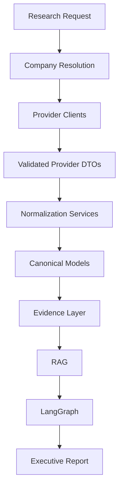
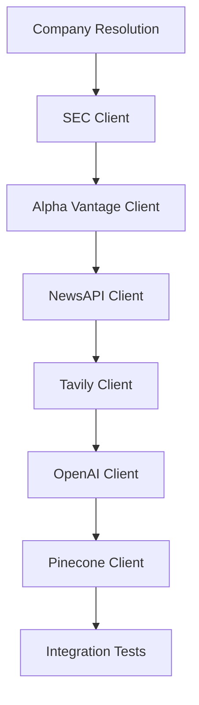

# Provider Integration Guide

## 1. Introduction

This document defines the integration contract for every external provider used by the Autonomous Company Research and Executive Report Generation Agent.

It is an implementation guide, not provider documentation. The purpose of this guide is to make future provider work predictable, consistent, and aligned with the approved architecture before implementation begins.

### Scope

- Defines how each provider fits into this architecture.
- Defines which provider-specific results are normalized into canonical models.
- Defines endpoint usage, authentication expectations, error handling, and security rules.
- Defines testing and implementation expectations for future provider work.

### Audience

- Developers implementing provider clients and downstream services.
- Technical reviewers validating architectural compliance.
- AI coding agents that must preserve the approved architecture.

### Relationship to the Blueprint and DIS

- The Technical Solution Blueprint is the highest architectural authority.
- The Developer Implementation Specification translates the Blueprint into repository and module rules.
- This guide must remain consistent with both documents.
- If future implementation details conflict with the Blueprint, the Blueprint wins.

## 2. Provider Architecture Overview

Providers sit below the application boundary and above canonical normalization. They are data acquisition adapters, not orchestration components.

### Architectural Rules

- Provider clients must remain isolated from each other.
- Provider clients must not know about LangGraph routing.
- Provider clients must not mutate shared state directly.
- Provider clients must return validated provider-specific results or DTOs.
- Canonical models are the only supported cross-module data contract.
- Raw provider payloads must be contained within the provider integration boundary.
- Normalization services must map provider fields into canonical models and register provenance.
- Provider-specific field names must not leak into graph routing or report generation.
- Typed provider exceptions may be raised by the client layer and translated later by services or LangGraph nodes.

## 3. Provider Summary

| Provider | Purpose | Authentication | Primary Output | Canonical Model | Implementation Stage | Status |
|---|---|---|---|---|---|---|
| SEC EDGAR | Regulatory identity, filings, and authoritative company facts. | SEC user-agent policy; no API key for data.sec.gov APIs. | Submissions, company facts, filing documents. | `ResolvedCompany`, `DocumentRecord`, `SourceRecord`, `EvidenceRecord` | Company Resolution and Provider Integration | Planned |
| Alpha Vantage | Structured financial evidence and market context. | API key. | Company overview and financial statement data. | `FinancialMetric`, `SourceRecord` | Provider Integration | Planned |
| NewsAPI | Optional current-news context. | API key. | News articles and metadata. | `NewsEvent`, `SourceRecord` | Optional Provider Integration | Planned |
| Tavily | Optional broader market and strategic context. | API key. | Search results and extracted context. | `MarketFinding`, `SourceRecord` | Optional Provider Integration | Planned |
| OpenAI | LLM generation and embedding support. | API key. | Report drafts, validation output, embeddings. | `ReportSection`, `ReportValidationResult` | RAG and Report Generation | Planned |
| Pinecone | Vector storage and retrieval for document evidence. | API key. | Vector write acknowledgements and query matches. | `RAGResult` | RAG | Planned |

## 4. Provider Specifications

### 4.1 SEC EDGAR

#### Provider Purpose

SEC EDGAR is the primary authoritative regulatory source. It provides identity resolution, filing history, company facts, and official filing documents.

#### Official Documentation

- [SEC Developer Resources](https://www.sec.gov/about/developer-resources)
- [Accessing EDGAR Data](https://www.sec.gov/search-filings/edgar-search-assistance/accessing-edgar-data)
- [EDGAR APIs](https://www.sec.gov/search-filings/edgar-application-programming-interfaces)

#### Authentication

- Data APIs on `data.sec.gov` do not require an API key.
- The integration must send a clear `User-Agent` header that identifies the application and a real contact channel.
- Authentication is operational rather than secret-based.
- The user-agent string should be stored in centralized configuration when the SEC client is implemented.
- No raw credentials or secrets should be logged.
- A missing or invalid user-agent is invalid provider configuration or policy non-compliance, not an authentication error.
- SEC fair-access guidance applies to the application as a whole: keep requests conservative, stay at or below the published 10 requests per second ceiling, retry only in bounded fashion, avoid aggressive crawling, and download only the documents required for the run.

#### Endpoints Used

| Endpoint | Purpose | Method | Important Parameters | Expected Response |
|---|---|---|---|---|
| Company tickers lookup source | Map tickers to CIK values. | `GET` | None. | JSON mapping of ticker, CIK, and company name. |
| `data.sec.gov/submissions/CIK##########.json` | Retrieve filing history and entity metadata. | `GET` | 10-digit zero-padded CIK. | JSON submissions history. |
| `data.sec.gov/api/xbrl/companyfacts/CIK##########.json` | Retrieve structured company facts. | `GET` | 10-digit zero-padded CIK. | JSON company facts payload. |
| EDGAR filing index and filing documents | Discover and retrieve filing documents. | `GET` | CIK, accession number, and filing document path. | JSON filing index, HTML, text, or XML filing content. |

#### Canonical Model Mapping

| Provider Response | Normalization Service | Canonical Model | Used By |
|---|---|---|---|
| Ticker / CIK lookup response | Company resolution service | `ResolvedCompany` | Company resolution. |
| Submissions history | Source registration service | `SourceRecord`, `DocumentRecord` | Source registration and document handling. |
| Company facts | Evidence normalization service | `EvidenceRecord` | Evidence normalization. |
| Filing documents | Document processing service, source registration service | `DocumentRecord`, `SourceRecord` | Document processing and registration. |

#### Error Handling Strategy

- Authentication is not key-based, but an invalid or missing user-agent string must be treated as invalid provider configuration or policy non-compliance.
- Timeouts must be bounded and configurable.
- Rate limiting must be respected conservatively and handled as a retryable transient condition only when the response explicitly indicates it.
- Invalid company lookups must fail the company-resolution branch.
- Empty filing histories must be treated as insufficient authoritative evidence when regulatory coverage is mandatory.
- Provider client failures must surface as typed provider exceptions or typed results within the provider boundary.
- Services or LangGraph nodes translate those outcomes into `WorkflowWarning` or `WorkflowError` records before any shared-state updates occur.

#### Security Considerations

- Use centralized configuration for the user-agent string.
- Do not log filing URLs, query strings, or environment values if they contain sensitive information.
- Preserve HTTPS-only access.
- Treat stored raw filing content as source data, not executable content.
- Respect fair access by throttling below the published maximum of 10 requests per second, using bounded retries, and downloading only required documents.

#### Implementation Notes

- Use SEC data only as an authoritative source of company identity and filings.
- Normalize dates to ISO 8601 and preserve filing periods.
- Preserve CIK, accession number, filing type, and source URL.
- Keep SEC normalization separate from downstream report synthesis.

### 4.2 Alpha Vantage

#### Provider Purpose

Alpha Vantage is the structured financial provider for the MVP. It supplies financial statements and optional market data that support the Financial Performance section.

#### Official Documentation

- [Alpha Vantage API Documentation](https://www.alphavantage.co/documentation/)

#### Authentication

- Authentication uses an API key.
- The API key must be read from centralized configuration only.
- The key should be passed through the provider request mechanism used by the client.
- Credentials must never be printed, logged, or embedded in fixtures.

#### Endpoints Used

| Endpoint | Purpose | Method | Important Parameters | Expected Response |
|---|---|---|---|---|
| `https://www.alphavantage.co/query?function=OVERVIEW` | Retrieve company overview metadata. | `GET` | `symbol`, `apikey`. | JSON overview payload. |
| `https://www.alphavantage.co/query?function=INCOME_STATEMENT` | Retrieve income statement data. | `GET` | `symbol`, `apikey`. | JSON financial statements payload. |
| `https://www.alphavantage.co/query?function=BALANCE_SHEET` | Retrieve balance sheet data. | `GET` | `symbol`, `apikey`. | JSON financial statements payload. |
| `https://www.alphavantage.co/query?function=CASH_FLOW` | Retrieve cash flow data. | `GET` | `symbol`, `apikey`. | JSON financial statements payload. |
| `https://www.alphavantage.co/query?function=GLOBAL_QUOTE` | Retrieve optional market quote data. | `GET` | `symbol`, `apikey`. | JSON quote payload. |

#### Canonical Model Mapping

| Provider Response | Normalization Service | Canonical Model | Used By |
|---|---|---|---|
| Financial payloads | Financial normalization service | `FinancialMetric` | Financial collection and reporting. |
| Retrieval metadata | Source registration service | `SourceRecord` | Provenance and source registry. |

#### Error Handling Strategy

- Authentication errors must fail the provider branch and surface a structured error.
- Rate limits must be treated as bounded transient failures.
- Missing or partial statement data must be preserved as explicit gaps, not inferred.
- Empty or malformed responses must fail normalization when the missing data blocks required reporting.
- If SEC evidence is sufficient for the mandatory financial narrative, the workflow may continue with warnings after an Alpha Vantage failure; otherwise it must fail.

#### Security Considerations

- Keep the API key in `.env` and load it only through settings.
- Never place the key in query strings in logs or traces.
- Preserve TLS-only transport.
- Do not expose provider payloads beyond the client and normalization layers.

#### Implementation Notes

- Preserve reporting period, units, and currency on every normalized record.
- Use Alpha Vantage only for structured financial evidence and limited market context.
- Do not treat Alpha Vantage as a factual source for identity or filings.

### 4.3 NewsAPI

#### Provider Purpose

NewsAPI supplies optional recent-news context for company-related developments.

#### Official Documentation

- [News API Documentation](https://newsapi.org/docs)

#### Authentication

- Authentication uses an API key.
- The API key must be loaded through centralized settings.
- Request headers or query parameters must never leak credentials into logs.
- The client should treat the key as a secret even though the provider is optional.

#### Endpoints Used

| Endpoint | Purpose | Method | Important Parameters | Expected Response |
|---|---|---|---|---|
| `https://newsapi.org/v2/everything` | Search articles relevant to a company or ticker. | `GET` | `q`, `from`, `to`, `language`, `sortBy`, `pageSize`. | JSON article list with metadata. |
| `https://newsapi.org/v2/top-headlines` | Deferred future capability for headline-oriented use cases. | `GET` | `q`, `country`, `category`, `pageSize`. | JSON headline list with metadata. |

#### Canonical Model Mapping

| Provider Response | Normalization Service | Canonical Model | Used By |
|---|---|---|---|
| Article search results | News normalization service | `NewsEvent` | Optional context collection and report drafting. |
| Provider metadata and source details | Source registration service | `SourceRecord` | Source registry and provenance tracking. |

#### Error Handling Strategy

- Authentication failures must be handled as structured errors.
- Rate-limited or quota-limited responses should degrade to warnings when the branch is optional.
- Empty result sets are valid and should be recorded as absence of context, not as failed execution by themselves.
- Invalid company queries should be deduplicated and normalized before retrying.
- Partial failures must not block mandatory regulatory or financial branches.

#### Security Considerations

- Store the key in environment variables only.
- Do not log article payloads with hidden secrets.
- Use HTTPS for all requests.
- Avoid retaining unnecessary personal data from news content.

#### Implementation Notes

- Treat news as supplementary context, not authoritative evidence.
- Deduplicate by normalized identity, title, and publication date.
- Preserve publication time, article URL, and source metadata.

### 4.4 Tavily

#### Provider Purpose

Tavily supplies optional broader web context for market, industry, and strategic research.

#### Official Documentation

- [Tavily Docs](https://docs.tavily.com/welcome)
- [Tavily API Reference: Introduction](https://docs.tavily.com/documentation/api-reference/introduction)

#### Authentication

- Authentication uses an API key.
- The key must be read from centralized settings.
- The client should use the provider's documented bearer-token mechanism.
- Optional project identifiers should be handled as configuration, not hardcoded values.
- `/search` is the primary MVP endpoint.
- `/extract` is deferred unless a selected search result later requires deeper content extraction.

#### Endpoints Used

| Endpoint | Purpose | Method | Important Parameters | Expected Response |
|---|---|---|---|---|
| `https://api.tavily.com/search` | Search the web for company, market, and competitor context. | `POST` | `query`, optional `topic`, `days`, `include_answer`. | JSON search results and summary context. |
| `https://api.tavily.com/extract` | Deferred: extract content only after a selected search result requires deeper review. | `POST` | `urls` or equivalent documented input. | JSON extracted page content. |

#### Canonical Model Mapping

| Provider Response | Normalization Service | Canonical Model | Used By |
|---|---|---|---|
| Search results | Tavily normalization service | `MarketFinding` | Optional market-research collection. |
| Extracted page content | Deferred future capability | Not stored in shared state. | Not stored in shared state. |
| Provider metadata and source references | Source registration service | `SourceRecord` | Source registry and provenance. |

#### Error Handling Strategy

- Authentication errors must become structured provider failures.
- Search failures should degrade to warnings when the provider is optional.
- Empty search results are acceptable and should be preserved as missing context.
- Timeouts and transient transport errors may be retried in bounded fashion.
- Invalid or over-broad queries should be normalized before any retry attempt.

#### Security Considerations

- Keep API keys in environment variables.
- Do not log extracted page content that may contain sensitive or unnecessary details.
- Preserve HTTPS transport.
- Avoid storing secrets or hidden request metadata in shared state.

#### Implementation Notes

- Tavily is a context provider, not an authoritative evidence source.
- Use it to enrich the market and strategic narrative, not to replace SEC or first-party sources.
- Preserve URLs and query metadata for traceability.

### 4.5 OpenAI

#### Provider Purpose

OpenAI provides two separate processing responsibilities: generation for report drafting, report validation, and bounded repair; and embeddings for document and query vector preparation. OpenAI is a processing provider, not a factual evidence source.

#### Official Documentation

- [OpenAI API Quickstart](https://platform.openai.com/docs/quickstart/make-your-first-api-request)
- [OpenAI API Reference](https://platform.openai.com/docs/api-reference/backward-compatibility)

#### Authentication

- Authentication uses an API key with Bearer authorization.
- The API key must come from centralized settings only.
- The key must never be embedded in prompts, stored in state, or written to logs.
- If organization or project scoping is used, it must be derived from approved configuration only.

#### Endpoints Used

| Endpoint | Purpose | Method | Important Parameters | Expected Response |
|---|---|---|---|---|
| `https://api.openai.com/v1/responses` | Generate report text, validation reasoning, and repair instructions. | `POST` | `model`, input content, output formatting options. | Structured model response with generated text. |
| `https://api.openai.com/v1/embeddings` | Generate embeddings for approved text inputs. | `POST` | `model`, `input`. | Vector embedding response. |

#### Canonical Model Mapping

| Provider Response | Normalization Service | Canonical Model | Used By |
|---|---|---|---|
| Report drafts and validation output | OpenAI generation service, report validation service | `ReportSection`, `ReportValidationResult` | Report generation and validation services. |
| Embedding vectors | OpenAI embedding service | Not stored in shared state | Pinecone ingestion and retrieval preparation. |

#### Error Handling Strategy

- Authentication failures must fail the affected branch.
- Timeouts must be bounded and configurable.
- Malformed model output must be treated as a validation failure, not a successful completion.
- Empty or truncated output must not be silently accepted for report sections.
- Retries must remain bounded and deterministic.

#### Security Considerations

- Use environment variables or a secret manager for key storage.
- Never log prompts, responses, or secrets verbatim when they contain confidential data.
- Keep transport over HTTPS.
- Minimize the amount of sensitive source text sent to the model.

#### Implementation Notes

- OpenAI generation and embedding responsibilities may share credentials and centralized settings, but the integration responsibilities remain separate and focused.
- OpenAI must not replace evidence normalization or source provenance.
- Its output must be validated before it can become canonical report content.

### 4.6 Pinecone

#### Provider Purpose

Pinecone provides vector storage and retrieval for company-scoped document evidence.

#### Official Documentation

- [Pinecone API Reference](https://docs.pinecone.io/reference/api/introduction)
- [Pinecone Upsert Data Guide](https://docs.pinecone.io/guides/index-data/upsert-data)
- [Pinecone Upsert Records](https://docs.pinecone.io/reference/api/2024-04/data-plane/upsert)

#### Authentication

- Authentication uses an API key.
- The key must be loaded only through centralized settings.
- The official Pinecone SDK should be preferred.
- The supported API version must align with the pinned SDK version.
- Any required version header belongs in centralized provider configuration.
- Requests must target the index host.
- Namespace strategy must be explicit and deterministic.
- Requests must include the documented `Api-Key` header.

#### Endpoints Used

| Endpoint | Purpose | Method | Important Parameters | Expected Response |
|---|---|---|---|---|
| `upsert` on the index host | Store embedding vectors and metadata. | `POST` | `vectors`, `namespace`, optional SDK-aligned version header. | Technical write acknowledgement only. |
| `query` on the index host | Retrieve semantically relevant vectors with metadata filters. | `POST` | Query vector, top-k, namespace, filters. | Ranked matches and metadata. |
| `delete` on the index host | Remove stale vectors during controlled reindexing. | `POST` | IDs, namespace, or filter. | Technical deletion acknowledgement only. |

#### Canonical Model Mapping

| Provider Response | Normalization Service | Canonical Model | Used By |
|---|---|---|---|
| Upsert | Pinecone indexing helper | Not stored in shared state. | RAG indexing and persistence. |
| Query | RAG retrieval service | `RAGResult` | RAG retrieval and evidence conversion. |
| Delete | Pinecone maintenance helper | Not stored in shared state. | Index maintenance. |

#### Error Handling Strategy

- Authentication failures must fail the RAG branch.
- Index unavailability must fail the RAG branch unless a Blueprint-approved fallback exists.
- Upsert and query errors must be represented as structured workflow failures or warnings depending on branch criticality.
- Namespace or metadata-filter mistakes must fail validation before retrieval is considered successful.
- Stale or duplicate vectors must be handled through deterministic upsert rules.
- Pinecone writes are eventually consistent; successful writes may not be visible to queries immediately.
- Successful upsert acknowledgements must not be treated as query-visible confirmation.

#### Security Considerations

- Never log raw vectors, API keys, or unnecessary query metadata.
- Use HTTPS transport only.
- Keep company isolation in namespaces or metadata filters.
- Do not store full raw documents in shared state.

#### Implementation Notes

- Pinecone is infrastructure for retrieval, not a primary evidence source.
- Company isolation must be enforced at the namespace or metadata-filter level.
- Upsert must replace existing records for the same identifier instead of duplicating them.

## 5. Cross-Provider Design Rules

- Providers must never know each other.
- Providers must never call LangGraph directly.
- Providers must never interact with Pinecone directly unless they are the Pinecone client itself.
- Providers must return validated provider-specific results or DTOs, not canonical models directly.
- Providers must never expose raw API responses outside the client layer.
- Providers must remain stateless.
- All retries must be deterministic and bounded.
- All timestamps must use UTC where timestamps are produced or normalized.
- All responses must be validated before transformation into canonical models.
- Serialization must remain JSON friendly so responses can be traced and tested without custom transport objects.
- Error information must be reduced to architecture-level warnings and workflow errors before it leaves the provider boundary.

## 6. Canonical Model Traceability

| Provider | Endpoint / Operation | Provider Result | Normalization Service | Canonical Model | Shared State Field |
|---|---|---|---|---|---|
| SEC EDGAR | company tickers and submissions | Provider-specific lookup and submission DTOs | Company resolution service | `ResolvedCompany` | `resolved_company` |
| SEC EDGAR | company facts | Provider-specific company facts DTOs | Evidence normalization service | `EvidenceRecord` | `evidence` |
| SEC EDGAR | filing metadata and document retrieval | Provider-specific filing DTOs | Document processing service, source registration service | `DocumentRecord`, `SourceRecord` | `documents`, `sources` |
| Alpha Vantage | overview and statement endpoints | Provider-specific financial DTOs | Financial normalization service | `FinancialMetric` | `financial_metrics` |
| Alpha Vantage | retrieval metadata | Provider-specific provenance details | Source registration service | `SourceRecord` | `sources` |
| NewsAPI | `/v2/everything` | Provider-specific article DTOs | News normalization service | `NewsEvent` | `news_events` |
| NewsAPI | article metadata | Provider-specific provenance details | Source registration service | `SourceRecord` | `sources` |
| Tavily | `/search` | Provider-specific search DTOs | Tavily normalization service | `MarketFinding` | `market_findings` |
| Tavily | `/extract` | Deferred future capability | Not stored in shared state | Not stored in shared state | Not stored in shared state |
| OpenAI | `/v1/responses` generation path | Provider-specific generation DTOs | Report generation service, report validation service | `ReportSection`, `ReportValidationResult` | `report_sections`, `report_validation` |
| OpenAI | `/v1/embeddings` | Embedding vectors | Embedding preparation service | Not stored in shared state | Not stored in shared state |
| Pinecone | upsert on index host | Technical write acknowledgement | Pinecone indexing helper | Not stored in shared state | Not stored in shared state |
| Pinecone | query on index host | Ranked search results | RAG retrieval service | `RAGResult` | `rag_results` |
| Pinecone | delete on index host | Technical deletion acknowledgement | Pinecone maintenance helper | Not stored in shared state | Not stored in shared state |

## 7. Testing Strategy

The testing strategy must remain offline by default and must verify provider behavior in isolation.

### Required Testing Patterns

- Unit tests for mapping, validation, and serialization.
- Mock provider responses for all external calls.
- Schema validation for payload shape and required fields.
- Error simulation for authentication, timeout, and rate-limit cases.
- Empty-response simulation for optional and required branches.
- Serialization validation for canonical-model compatibility.
- Company-isolation tests for Pinecone-related indexing and retrieval.

### Testing Rules

- Do not require live credentials for unit tests.
- Do not couple tests to network availability.
- Do not use provider fixtures that contain secrets.
- Keep provider tests separated from graph, report, and end-to-end tests.

## 8. Security Guidelines

- Store credentials only in environment variables or an approved secret manager.
- Keep `.env.example` committed and free of real secrets.
- Keep `.env` local and uncommitted.
- Do not print or log API keys.
- Redact secrets from diagnostic output.
- Preserve HTTPS for all provider traffic.
- Update dependencies deliberately and review provider-facing changes for security impact.
- Treat provider responses as untrusted input until validated.

## 9. Implementation Roadmap

The recommended implementation order follows the Blueprint and the DIS.

### Why This Order

- Company resolution establishes the canonical company identity before any provider data is normalized.
- SEC comes first because it is the primary authoritative regulatory source.
- Alpha Vantage follows because financial evidence is mandatory for the report.
- NewsAPI and Tavily are optional and should be added after the required evidence path is stable.
- OpenAI follows because generation, validation, bounded repair, and embedding preparation should consume already-normalized evidence.
- Pinecone follows because retrieval must operate over stable document and evidence contracts.
- Integration tests come last so the client boundaries are verified after each provider is isolated.

## 10. Appendices

### A. Official Documentation Links

- [SEC Developer Resources](https://www.sec.gov/about/developer-resources)
- [Accessing EDGAR Data](https://www.sec.gov/search-filings/edgar-search-assistance/accessing-edgar-data)
- [EDGAR APIs](https://www.sec.gov/search-filings/edgar-application-programming-interfaces)
- [Alpha Vantage API Documentation](https://www.alphavantage.co/documentation/)
- [News API Documentation](https://newsapi.org/docs)
- [Tavily Docs](https://docs.tavily.com/welcome)
- [OpenAI API Quickstart](https://platform.openai.com/docs/quickstart/make-your-first-api-request)
- [OpenAI API Reference](https://platform.openai.com/docs/api-reference/backward-compatibility)
- [Pinecone API Reference](https://docs.pinecone.io/reference/api/introduction)

### B. Provider Limitations

| Provider | Key Limitation |
|---|---|
| SEC EDGAR | Must respect fair-access rules, declared user-agent requirements, and conservative request throttling. |
| Alpha Vantage | Subject to plan-specific quota and rate-limit constraints. |
| NewsAPI | Subject to plan-specific quota and rate-limit constraints. |
| Tavily | Subject to plan-specific quota and rate-limit constraints. |
| OpenAI | Subject to model, organization, and usage limits. |
| Pinecone | Subject to index host, namespace, and SDK-aligned API-version constraints. |

### C. Rate-Limit Guidance

- SEC EDGAR requests must be conservative, user-agent compliant, and below the published 10 requests per second ceiling.
- Alpha Vantage, NewsAPI, Tavily, OpenAI, and Pinecone must use bounded retries and timeouts.
- Optional providers should degrade to warnings when unavailable.
- Required providers should fail safely when rate limits prevent mandatory evidence collection.

### D. Useful References

- Blueprint sections 4, 5, 6, 7, 8, and 9.
- DIS sections 4, 5, 6, 7, 8, 10, and 27.
