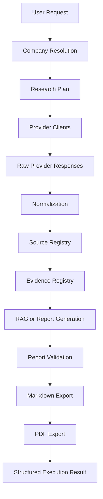
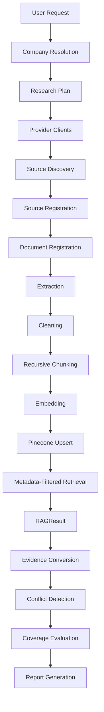
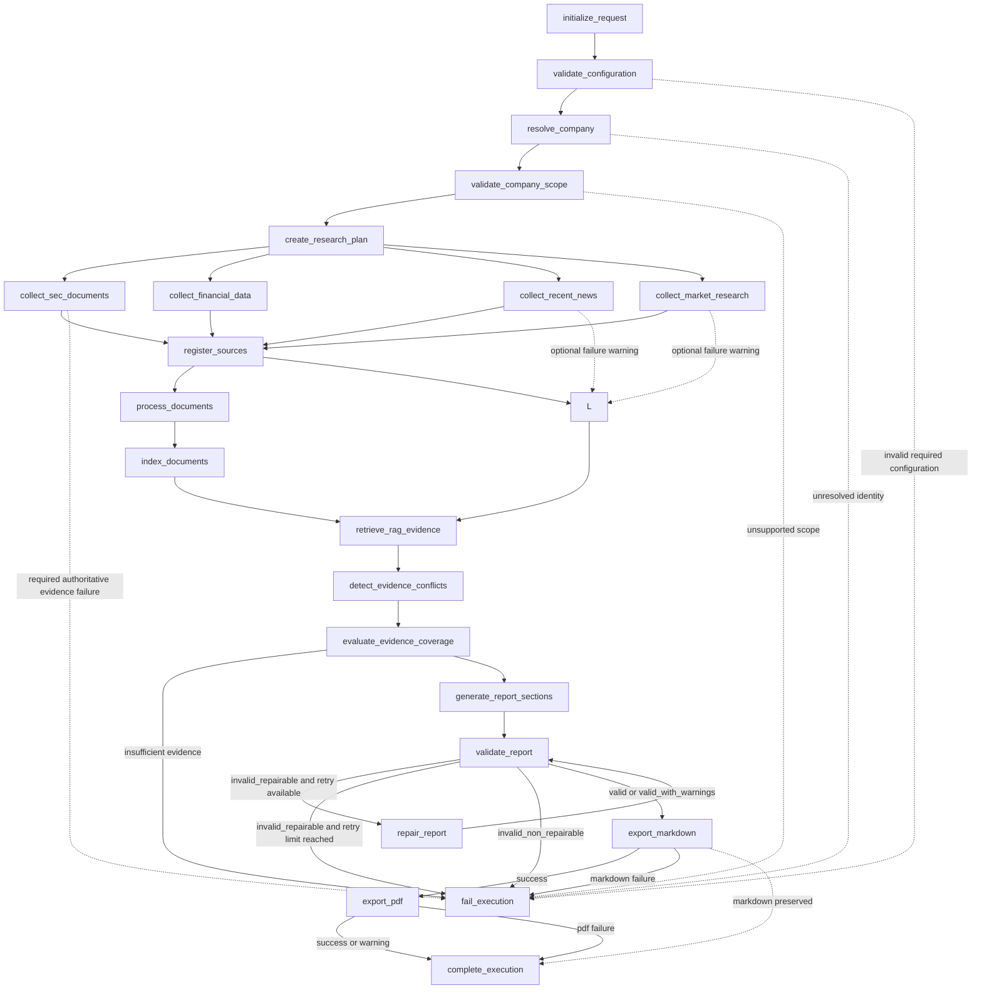

# Technical Solution Blueprint

**Project:** Autonomous Company Research and Executive Report Generation Agent  
**Working Name:** Company Intelligence Agent  
**Repository:** `autonomous-company-research-agent`  
**Document Version:** 1.0  
**Status:** Approved for Implementation  
**Primary Audience:** Developers, technical reviewers, project evaluators, and AI coding agents  
**Companion Document:** `docs/DEVELOPER_IMPLEMENTATION_SPECIFICATION.md`  
**Last Updated:** 2026-07-18

**Document Purpose**  
This Blueprint is the architectural source of truth for the project. It defines the approved scope, workflow semantics, report requirements, data-source hierarchy, shared state design, implementation boundaries, and quality expectations for the Company Intelligence Agent.

**Document Authority**  
The Blueprint takes precedence over implementation details whenever scope, architecture, workflow semantics, evidence behaviour, or report requirements are involved. A future Developer Implementation Specification will translate this Blueprint into day-to-day coding rules, but that companion document must remain compatible with the requirements defined here.

**Normative Language**  
The terms MUST, MUST NOT, SHOULD, SHOULD NOT, and MAY are used with their normative meanings throughout this document. MUST indicates a mandatory requirement. MUST NOT indicates a prohibited behaviour. SHOULD indicates a strong recommendation. SHOULD NOT indicates an approach that should generally be avoided. MAY indicates an optional capability.

**Table of Contents**

- [1. Product Definition](#1-product-definition)
- [2. MVP Scope](#2-mvp-scope)
- [3. Executive Report Specification](#3-executive-report-specification)
- [4. Data Source Architecture](#4-data-source-architecture)
- [5. API Specification & Validation Plan](#5-api-specification--validation-plan)
- [6. Knowledge Base & RAG Design](#6-knowledge-base--rag-design)
- [7. Workflow Architecture & LangGraph Design](#7-workflow-architecture--langgraph-design)
- [8. Shared State Specification](#8-shared-state-specification)
- [9. Project Structure & Implementation Architecture](#9-project-structure--implementation-architecture)
- [10. Testing & Quality Assurance](#10-testing--quality-assurance)
- [11. Implementation Roadmap](#11-implementation-roadmap)

## 1. Product Definition

### 1.1 Product Name

The formal project name is **Autonomous Company Research and Executive Report Generation Agent**. The working product name is **Company Intelligence Agent**.

### 1.2 Product Vision

The system MUST produce an evidence-driven executive report for a single public company by combining authoritative sources, structured financial providers, controlled retrieval, and validated report generation. The product is intended to reduce research fragmentation by producing a traceable, reproducible, and executive-friendly output from a single execution.

### 1.3 Problem Statement

Company research is typically fragmented across regulatory filings, company publications, news, market context, and financial data providers. Generic LLM output is insufficient because it can omit evidence provenance, conflate unsupported facts, and fail to preserve reporting periods or source authority. The product addresses these issues by enforcing source hierarchy, evidence registration, controlled retrieval, and validation before report export.

### 1.4 Product Goal

The complete high-level goal is to accept a company name or ticker, resolve the correct public company identity, collect and normalize authoritative evidence, synthesize an executive report, validate the output, and export both Markdown and PDF artifacts with execution metadata and warnings.

### 1.5 Primary Users

Primary users include business consultants, executive teams, business analysts, financial researchers, investors performing initial company research, and students studying LangGraph, LangChain, RAG, and AI workflow integration.

### 1.6 Core User Story

As a user, I provide a public company name or ticker and receive a grounded executive report with evidence-backed findings, source traceability, and exportable deliverables.

### 1.7 Primary Input

The required input is a company name or ticker. Optional execution parameters MAY include report language, reporting currency, news lookback period, PDF preference, output directory, and enabled optional providers. Sensible defaults SHOULD be used when optional parameters are omitted.

### 1.8 Primary Output

The primary output is a Markdown executive report. The system MUST also produce a PDF artifact when the export path is enabled and successful. The execution result MUST include metadata, warnings, errors, and completion status.

### 1.9 Core Value Proposition

The product value is defined by evidence grounding, source prioritization, consistency, traceability, and executive synthesis. The workflow MUST prefer authoritative sources, preserve period context, and distinguish facts from analysis.

### 1.10 Product Principles

The following principles govern the product:

- Evidence before narrative.
- Authority before convenience.
- Traceability over apparent certainty.
- Structured outputs over uncontrolled free-form responses.
- Graceful degradation for optional providers.
- Explicit failure for insufficient authoritative evidence.
- One company per execution.
- Markdown as the canonical report format.
- PDF as a derived artifact.
- Human-readable executive outputs.
- MVP discipline.
- No unsupported material claims.
- No speculative feature expansion.
- No overengineering.

### 1.11 Functional Capabilities

| Capability | Description |
|---|---|
| Company resolution | Resolve name, ticker, exchange, and regulatory identifiers. |
| Research planning | Create a bounded source plan before collection begins. |
| Regulatory collection | Retrieve SEC EDGAR data and filing references. |
| Financial collection | Retrieve normalized financial metrics from Alpha Vantage. |
| Optional context collection | Retrieve news and broader market context when available. |
| Evidence registration | Record sources, provenance, and normalized evidence. |
| RAG retrieval | Index and retrieve official document evidence. |
| Workflow orchestration | Execute the research pipeline through LangGraph. |
| Report generation | Produce sectioned Markdown executive reports. |
| Validation and repair | Validate report quality and repair limited issues when possible. |
| Export | Create Markdown and PDF artifacts. |

### 1.12 Product Boundaries

The system is not a replacement for professional investment advice, legal due diligence, audited financial analysis, forecasting, real-time trading, or proprietary market intelligence platforms. The product MUST remain limited to public-company research and MUST NOT claim unsupported certainty.

### 1.13 Success Definition

A successful execution resolves the company, gathers evidence from approved sources, produces a validated Markdown executive report, exports a PDF artifact when enabled, and returns a structured execution result with any warnings or limitations clearly identified.

### 1.14 Product-Level Constraints

The product is constrained by public data availability, provider uptime, rate limits, jurisdictional scope, language-model limitations, and one-company-per-run execution. The initial supported scope focuses on publicly listed companies, with US public companies covered by SEC EDGAR as the primary implementation scope.

### 1.15 Product-Level Acceptance Criteria

The product level is acceptable when the system can run end to end for a reference public company, preserve evidence provenance, clearly identify optional-provider failures as warnings, and produce a report that matches the approved structure without fabricated claims.

## 2. MVP Scope

### 2.1 Scope Objective

The MVP MUST prove that the system can complete a single-company research execution from resolution through report export using authoritative evidence and a bounded workflow.

### 2.2 MVP Execution Flow



### 2.3 Included Capabilities

The MVP includes company resolution, research planning, SEC collection, financial collection, optional news, optional market research, official company sources, evidence registry, source registry, document processing, Pinecone RAG, LangGraph orchestration, report generation, report validation, Markdown export, PDF export, and a structured execution result.

### 2.4 Required and Optional Components

| Component | Classification | Purpose | Failure Behaviour |
|---|---|---|---|
| SEC EDGAR | Required primary authoritative regulatory source | Resolve company identity and retrieve authoritative filings. | Fail the execution if identity cannot be resolved or minimum authoritative regulatory evidence is unavailable. |
| Alpha Vantage | Required structured financial provider for the intended MVP | Retrieve financial metrics and market-related company data. | Record a structured provider error; continue only if equivalent accepted SEC financial evidence exists and coverage remains sufficient, otherwise fail due to insufficient financial evidence. |
| Pinecone | Required infrastructure for the intended RAG demonstration | Store document embeddings and support semantic retrieval. | Fail the RAG branch if the index is unavailable unless a limited fallback has been explicitly approved and documented. |
| NewsAPI | Optional supplementary news provider | Retrieve recent company-related news. | Continue with a warning. |
| Tavily | Optional supplementary market research provider | Retrieve broader market and strategic context. | Continue with a warning. |
| Official Company Sources | Recommended authoritative first-party source | Retrieve investor relations, annual reports, and press releases. | Continue with a warning when SEC evidence remains sufficient; fail the evidence coverage gate if mandatory report sections remain unsupported. |
| LangGraph | Required orchestration layer | Control workflow routing, retries, and completion states. | Fail the run if workflow orchestration cannot be constructed. |
| PDF Exporter | Optional / Derived | Render the accepted Markdown report to PDF. | Preserve Markdown output and complete with warnings if PDF export fails. |

### 2.5 MVP Interface

The MVP MAY use a CLI, Python entry command, or a minimal FastAPI endpoint. A full frontend is out of scope.

### 2.6 MVP Company Coverage

The MVP prioritizes US public companies because SEC EDGAR offers the clearest authoritative identity and filing coverage. Non-US public companies MAY be supported later if source coverage and validation remain compatible with this Blueprint.

### 2.7 MVP Time Horizon

The workflow MUST preserve evidence dates, filing dates, and financial reporting periods. The report MUST not silently merge incompatible periods.

### 2.8 Out of Scope

The MVP explicitly excludes authentication, user management, a production frontend, scheduling, monitoring, multi-company comparison, private company intelligence, investment recommendations, forecasting, multi-agent architecture, distributed infrastructure, relational application persistence, and enterprise deployment.

### 2.9 MVP Constraints

The MVP SHOULD remain small enough for an academic project while still demonstrating a complete research-to-report pipeline. The implementation SHOULD prefer correctness, traceability, and bounded scope over feature breadth.

### 2.10 MVP Quality Priorities

The quality order is:

1. Evidence traceability
2. Workflow completion
3. Report grounding
4. Company resolution
5. Failure handling
6. Maintainability
7. Reproducibility
8. Presentation
9. Performance
10. Feature breadth

### 2.11 Reference Acceptance Scenario

Apple Inc. is the reference company. The preferred validation input is Apple or AAPL.

### 2.12 MVP Completion Criteria

The MVP is complete when a single public-company run produces a validated Markdown executive report, a PDF artifact when enabled, evidence and source registries with provenance, and a structured execution result that distinguishes successes, warnings, and failures.

## 3. Executive Report Specification

### 3.1 Report Objective

The Executive Report is the primary user-facing deliverable. It MUST summarize the company, evidence, financial performance, recent developments, market context, strategic analysis, risks, and limitations in a format suitable for executive review.

### 3.2 Canonical Format

Markdown is the canonical report format. PDF is derived from the accepted Markdown report and MUST not use a separate content-generation path. Section 3 depends on evidence rules in Sections 4 and 8.

### 3.3 Intended Reader and Writing Style

The report is intended for executive and analyst readers. The writing style MUST be concise, factual, and professionally synthesized. It MUST avoid unsupported claims, recommendation language, and speculative certainty.

### 3.4 Mandatory Report Structure

The report MUST include exactly these top-level content areas:

1. Report Metadata
2. Executive Summary
3. Company Overview
4. Business Model and Revenue Drivers
5. Financial Performance
6. Recent Developments
7. Market and Competitive Context
8. Strategic Analysis
9. Risks and Watchpoints
10. Key Conclusions
11. Sources and Research Limitations

### 3.5 Report Metadata

Required metadata fields MUST include company name, ticker, research date, research period, report version, and report status. Conditional metadata fields MAY include exchange, regulatory identifier, and execution ID when available and useful.

### 3.6 Executive Summary

The Executive Summary MUST be written after the detailed sections are complete. It SHOULD be approximately 250 to 500 words, contain no new unsupported facts, and MUST not include an investment recommendation.

### 3.7 Company Overview

This section SHOULD identify the company, its business lines, public listing context, and any regulatory or identity details that are relevant to the evidence base.

### 3.8 Business Model and Revenue Drivers

This section MUST describe the primary ways the company generates revenue and the major drivers that influence performance. Claims MUST be traceable to approved evidence or clearly labelled as analysis.

### 3.9 Financial Performance

Financial values MUST preserve currency, reporting period, source, units, and whether a value is reported or calculated. The report MUST not compare incompatible periods silently. Cross-references to evidence and source handling in Sections 4 and 8 SHOULD be used here.

### 3.10 Recent Developments

This section MUST distinguish confirmed company events, third-party reporting, and speculation. Unverified claims MUST be excluded or explicitly flagged.

### 3.11 Market and Competitive Context

The report MUST not fabricate market size, growth, or share. Market context SHOULD be derived from approved sources and framed conservatively when evidence is incomplete.

### 3.12 Strategic Analysis

The analysis SHOULD use a practical framework such as strengths, weaknesses, opportunities, and threats. Analytical inferences MUST be labelled as analysis and MUST not be presented as fact.

### 3.13 Risks and Watchpoints

This section MUST distinguish reported risks, inferred risks, and unresolved uncertainties. The report SHOULD avoid overstating certainty about future outcomes.

### 3.14 Key Conclusions

Key Conclusions SHOULD contain approximately three to seven specific conclusions that follow directly from the evidence and analysis.

### 3.15 Sources and Research Limitations

This section MUST summarize the source base, freshness constraints, optional-provider gaps, and any evidence limitations that materially affect interpretation.

### 3.16 Citation and Evidence Rules

Every nontrivial factual claim SHOULD be traceable to a SourceRecord and EvidenceRecord. Section 3 depends on the source authority hierarchy in Section 4 and the state contract in Section 8.

### 3.17 Fact, Calculation, and Analysis Classification

The system MUST classify content as fact, calculation, or analysis. Calculations MUST preserve inputs and derived status. Analysis MUST be distinguishable from source-derived fact.

### 3.18 Missing Evidence Handling

When evidence is missing, the report MUST say so clearly rather than filling the gap with inference. Missing evidence MAY reduce report completeness or trigger validation warnings.

### 3.19 Conflicting Evidence Handling

Conflicts MUST be identified, registered, and presented as conflicts rather than silently resolved. The report SHOULD prefer authoritative sources when conflicts remain unresolved.

### 3.20 Report Validation Requirements

The allowed validation statuses are `valid`, `valid_with_warnings`, `invalid_repairable`, and `invalid_non_repairable`.

### 3.21 Controlled Report Repair

Repair MUST not create new evidence. Retry count MUST be bounded, and repairs MUST only correct structure, formatting, citation placement, or other limited issues already supported by existing evidence.

### 3.22 Markdown Requirements

Markdown MUST be the canonical authored format. Headings, tables, code blocks, and citations SHOULD be structurally consistent and valid for GitHub rendering.

### 3.23 PDF Requirements

PDF MUST be produced from accepted Markdown content. If PDF export fails, the Markdown report remains the authoritative artifact and the failure MUST be reported clearly.

### 3.24 Safety Requirements

The report MUST not include secrets, credentials, or unsupported legal or financial advice. It MUST avoid material claims that lack evidence.

### 3.25 Report Acceptance Criteria

A report is acceptable when it matches the mandatory structure, preserves period and source context, and passes validation without unresolved structural errors.

### 3.26 Report-Level MVP Boundaries

The report MUST NOT require valuation modelling, recommendations, ESG scoring, sentiment scoring, advanced charts, predictive scenarios, translation, or interactive dashboards.

## 4. Data Source Architecture

### 4.1 Architecture Objective

This architecture defines how source information enters the system, how it is normalized, and how it becomes evidence suitable for retrieval and reporting. Section 4 feeds the API contracts in Section 5 and the shared state in Section 8.

### 4.2 Source Categories

The source categories are:

- Regulatory sources
- Official company sources
- Structured financial sources
- News sources
- Market research sources
- Derived internal evidence

### 4.3 Source Authority Hierarchy

The source hierarchy MUST be:

1. Regulatory filings
2. Official company publications
3. Structured financial providers
4. Reputable news sources
5. Broader web research

Authority does not replace evidence validation. Higher authority improves trust but does not eliminate the need to normalize and cross-check data.

### 4.4 Data Acquisition Flow



### 4.5 Provider Responsibility Matrix

| Provider | Purpose | Authority | Required or Optional | Expected Outputs | Failure Behaviour |
|---|---|---|---|---|---|
| SEC EDGAR | Resolve identity, CIK, filings, company facts, and filing documents. | Primary authoritative regulatory source | Required | CIK, filings, submission metadata, company facts, filing references, document content | Fail the execution if identity cannot be resolved or minimum authoritative regulatory evidence is unavailable. |
| Alpha Vantage | Retrieve structured financial and market-related data. | Required structured financial provider for the intended MVP | Required | Company overview, income statement, balance sheet, cash flow, optional market metrics | Record a structured provider error; continue only if equivalent accepted SEC financial evidence exists and coverage remains sufficient, otherwise fail due to insufficient financial evidence. |
| NewsAPI | Retrieve company-related news. | Optional supplementary news provider | Optional | Recent articles, metadata, publication dates, URLs | Continue with a warning. |
| Tavily | Retrieve broader market and strategic context. | Optional supplementary market research provider | Optional | Broader context, competitor references, supporting web findings | Continue with a warning. |
| Official Company Sources | Retrieve investor relations, annual reports, and press releases. | Recommended authoritative first-party source | Applicable when enabled | First-party documents and public statements | Continue with a warning when SEC evidence remains sufficient; fail the evidence coverage gate if mandatory report sections remain unsupported. |
| Pinecone | Store embeddings for official document chunks and retrieval metadata. | Required infrastructure for the intended RAG demonstration | Required | Indexed chunks, metadata-filtered retrieval results | Fail the RAG branch if unavailable unless a limited fallback has been explicitly approved and documented. |

### 4.6 Source Selection Rules

The system MUST prefer authoritative and first-party sources, MUST preserve company identity and ticker context, and SHOULD deduplicate equivalent documents before evidence creation. Optional sources MAY be skipped without failing the execution.

### 4.7 Freshness and Time-Window Rules

Financial statements MUST preserve reporting periods. News and broader context SHOULD use an execution-configurable lookback window. Evidence freshness MUST be explicit in metadata.

### 4.8 Deduplication Strategy

The system SHOULD deduplicate by source identifier, URL, filing accession number, article title, content hash, and normalized company identity. Deduplication MUST occur before evidence records are finalized.

### 4.9 Source Registration

Each discovered source MUST be registered as a SourceRecord with provenance, provider name, acquisition timestamp, authority level, and references to raw payloads or stored artifacts. Source discovery precedes source registration; source registration precedes document registration and evidence conversion.

### 4.10 Evidence Creation

EvidenceRecord entries MUST capture the claim, supporting source references, extracted span or summary, timestamp context, and evidence classification. SEC EDGAR MAY produce structured regulatory facts that normalize directly into EvidenceRecord entries, while document-based evidence MUST flow through the document-processing and RAG conversion path.

### 4.11 Conflicting Source Handling

Conflicts MUST be explicitly represented as EvidenceConflict records. The workflow SHOULD prefer higher-authority evidence and MAY preserve unresolved lower-authority evidence as contextual background.

### 4.12 Missing Data Handling

If a source returns partial data, the system MUST record the omission, attach a warning, and continue only when the missing data does not block mandatory report sections.

### 4.13 Source Quality and Authority Assessment

A simple categorical authority level is preferred:

- primary
- authoritative_first_party
- structured_secondary
- reputable_secondary
- supplementary

### 4.14 Data Provenance

Provenance MUST show where the data came from, when it was collected, and how it was normalized. The lineage from raw provider output to final evidence MUST remain inspectable.

### 4.15 Data Source Acceptance Criteria

A source is acceptable when it can be mapped to the company identity, normalized into a consistent structure, and registered with provenance. Section 5 defines the provider contracts that make this possible.

## 5. API Specification & Validation Plan

### 5.1 Purpose

This section defines how provider clients are integrated, validated, normalized, and tested before LangGraph orchestration is assembled. Provider clients MUST remain independent of LangGraph and MUST expose canonical data to the workflow.

### 5.2 Integration Principles

Provider clients MUST isolate provider-specific logic, return normalized or clearly mapped responses, implement timeouts, implement bounded retries, classify provider failures, never expose API keys, and remain independent of LangGraph. Provider field names MUST NOT leak into graph routing.

### 5.3 Environment Variables

The expected environment variable inventory includes:

- `SEC_USER_AGENT`
- `ALPHA_VANTAGE_API_KEY`
- `NEWS_API_KEY`
- `TAVILY_API_KEY`
- `PINECONE_API_KEY`
- `PINECONE_INDEX_NAME`
- `OPENAI_API_KEY` or the selected embedding/LLM provider key
- optional runtime settings such as timeout and retry limits

Secrets MUST remain in `.env` and MUST NOT be hardcoded. Nodes and clients MUST read configuration through centralized settings only.

### 5.4 SEC EDGAR Specification

SEC EDGAR MUST support company identity resolution, ticker and CIK mapping, submissions, company facts, filing documents, and user-agent compliance. It MUST respect rate limits and produce normalized outputs for identity, filings, and document metadata. If company identity cannot be resolved or minimum authoritative regulatory evidence cannot be obtained for the supported scope, execution MUST fail.

Validation tests SHOULD cover:

- ticker-to-CIK resolution
- name ambiguity handling
- filing metadata extraction
- company facts normalization
- controlled error mapping

### 5.5 Alpha Vantage Specification

Alpha Vantage MUST support company overview, income statement, balance sheet, and cash flow retrieval. Market data MAY be used only when relevant to the report. The integration MUST preserve reporting periods and normalize units. Failure MUST be recorded as a structured provider error. The workflow MAY continue only when equivalent accepted SEC financial evidence exists and the evidence coverage gate confirms that the mandatory Financial Performance section can be generated reliably; otherwise execution MUST fail due to insufficient financial evidence.

Validation tests SHOULD cover:

- financial statement normalization
- period preservation
- quota and rate-limit handling
- missing-field handling
- controlled error mapping

### 5.6 NewsAPI Specification

NewsAPI MUST support query construction using company names and tickers, date-window filtering, relevance ranking, and deduplication. It is an optional supplementary news provider and MUST fail softly with a warning.

Validation tests SHOULD cover:

- ambiguous company-name queries
- article relevance filtering
- duplicate article removal
- empty-result handling

### 5.7 Tavily Specification

Tavily MUST support broader market, industry, competitor, and strategic context retrieval. It is an optional supplementary market research provider and MUST not block the workflow when unavailable.

Validation tests SHOULD cover:

- contextual query construction
- response normalization
- empty-result handling
- optional-provider warnings

### 5.8 Official Company Source Retrieval

Official Company Sources MUST be retrieved through dedicated source adapters or lightweight fetch helpers. The retrieval layer SHOULD cover investor relations pages, annual reports, earnings releases, press releases, governance pages, and similar first-party publications. These sources are recommended authoritative first-party evidence, not universally required inputs.

Validation tests SHOULD cover:

- source URL discovery
- document availability
- page retrieval or download normalization
- source metadata capture

### 5.9 Pinecone Connectivity Specification

Pinecone MUST support collection of embeddings for official document chunks and metadata-filtered retrieval. The integration MUST preserve company identity, document identity, source type, filing date, and chunk metadata.

Validation tests SHOULD cover:

- index availability
- upsert payload structure
- namespace and metadata filtering
- retrieval result normalization

### 5.10 LLM and Embedding Provider Boundary

The selected LLM or embedding provider MUST support controlled prompts, deterministic settings where practical, and bounded retries. The provider is processing infrastructure, not a factual evidence source. Model selection MUST remain configurable through centralized settings.

Validation tests SHOULD cover:

- prompt input structure
- response parsing
- malformed output handling
- retry and timeout behaviour

### 5.11 Provider Validation Workflow

```text
Configuration Validation
        ->
Connectivity Test
        ->
Minimal Request
        ->
Schema Inspection
        ->
Normalization Validation
        ->
Error Behaviour Validation
        ->
Integration Approval
```

Configuration validation confirms that the provider-specific settings exist or are intentionally absent for optional providers. Connectivity testing verifies basic transport reachability. Minimal request exercises the smallest useful provider call. Schema inspection checks that the payload structure is stable enough to normalize. Normalization validation confirms that canonical models can be produced. Error behaviour validation confirms the provider failure classification. Integration approval means the provider client may be connected to LangGraph.

A provider MUST NOT be integrated into LangGraph before isolated client validation is complete.

### 5.12 API Response Normalization

Raw provider payloads remain provider-specific. Clients or normalization services convert provider outputs into canonical models. Provider field names MUST NOT leak into graph routing. Dates MUST be normalized to ISO 8601. Timestamps SHOULD use UTC. Currencies and financial units MUST be preserved. Missing fields MUST remain explicit. Identifiers such as ticker, CIK, filing accession number, source URL, and document ID MUST be preserved when available. Normalized records MUST retain a link to the original provider source or stored raw response.

### 5.13 Timeout, Retry, and Rate-Limit Rules

All external provider calls MUST have configurable timeouts. Retries MUST be bounded. Only transient failures SHOULD be retried. Validation errors MUST NOT be retried automatically. Authentication failures MUST NOT be retried repeatedly. Rate-limit responses SHOULD respect provider retry guidance when available. Optional-provider failure MUST produce a warning. Required-provider failure MUST produce a structured error. No complex resilience framework is required for the MVP.

### 5.14 Provider Failure Classification

Provider failures MUST use the following practical classification:

- `transient`
- `rate_limited`
- `authentication`
- `invalid_request`
- `invalid_response`
- `unavailable`
- `insufficient_data`

`transient` and `rate_limited` failures MAY be retried in bounded fashion. `authentication`, `invalid_request`, `invalid_response`, and `unavailable` SHOULD generally fail immediately. `insufficient_data` SHOULD fail the affected branch when the missing data blocks mandatory report generation.

### 5.15 Mocking Strategy

Unit tests MUST NOT depend on live APIs. Provider responses SHOULD be represented through fixtures. Normalized outputs SHOULD be tested independently from HTTP transport. Live-provider tests MUST be marked as integration tests. Tests requiring API keys MUST be skipped safely when credentials are unavailable. No secrets may appear in test fixtures.

### 5.16 API Validation Matrix

| Provider | Configuration Test | Connectivity Test | Normalization Test | Failure Test | Required for Default Run |
|---|---|---|---|---|---|---|
| SEC EDGAR | Required | Required | Required | Required | Yes |
| Alpha Vantage | Required | Required | Required | Required | Yes |
| NewsAPI | Required when enabled | Required when enabled | Required when enabled | Required when enabled | No |
| Tavily | Required when enabled | Required when enabled | Required when enabled | Required when enabled | No |
| Official Company Sources | Applicable when enabled | Applicable when enabled | Applicable when enabled | Applicable when enabled | No |
| Pinecone | Required | Required | Required | Required | Yes for the RAG path |
| Selected LLM or embedding provider | Required | Required | Required | Required | Yes for report generation or embeddings |

### 5.17 Integration Acceptance Criteria

A provider client is acceptable when it loads from centralized settings, never exposes secrets, produces canonical normalized data, passes provider-specific validation tests, and can be integrated into the workflow only after isolated validation is complete.

## 6. Knowledge Base & RAG Design

### 6.1 RAG Objective

The knowledge base MUST support retrieval over official company documents and approved evidence while preserving company isolation, provenance, and report traceability.

### 6.2 Knowledge Base Scope

The knowledge base SHOULD focus on public-company documents needed for executive reporting. Official filings, investor relations materials, and approved supporting documents are in scope. Large raw artifacts MUST remain outside shared state.

### 6.3 Included Document Types

Included document types SHOULD cover SEC filings, annual reports, earnings releases, investor presentations, press releases, governance pages, and other first-party materials that support mandatory report sections.

### 6.4 Excluded or Restricted Content

Private documents, scraped copies with unclear provenance, unsupported third-party summaries, and large binary artifacts that cannot be normalized SHOULD be excluded or treated as restricted until approved.

### 6.5 Document Lifecycle

```text
Discovery
    ->
Download
    ->
Registration
    ->
Extraction
    ->
Cleaning
    ->
Recursive Chunking
    ->
Embedding
    ->
Pinecone Upsert
    ->
Metadata-Filtered Retrieval
    ->
RAGResult
    ->
Evidence Conversion
    ->
Conflict Detection
    ->
Coverage Evaluation
    ->
Report Generation
```

Large raw files remain outside shared state. Shared state SHOULD store references, metadata, and retrieval results rather than the full source payloads.

### 6.6 Document Registry

The document registry SHOULD record document ID, company identity, source ID, document type, filing type, filing date, fiscal period, storage path, and extraction status. The registry is the provenance bridge between raw files and retrieval artifacts.

### 6.7 Text Extraction

Text extraction SHOULD normalize PDFs, HTML pages, and text documents into a consistent intermediate representation while preserving document metadata and page or section references when available.

### 6.8 Text Cleaning

Cleaning SHOULD remove extraction noise, normalize whitespace, preserve headings, and keep table context where possible. Cleaning MUST not erase source identity or filing metadata.

### 6.9 Chunking Strategy

Recursive chunking is the default MVP strategy. It SHOULD preserve headings and section boundaries when possible, use a configurable chunk size, use a small configurable overlap, preserve page, section, document, filing, and source metadata, avoid cutting tables or headings when possible, and avoid multiple competing chunking pipelines. Fixed-size-only chunking is insufficient for long regulatory documents.

### 6.10 Embedding Strategy

The selected embedding provider MUST produce stable vectors for cleaned chunks. Embedding generation SHOULD be deterministic where practical and MUST preserve a pointer to the original document and chunk metadata.

### 6.11 Pinecone Index Design

The Pinecone index SHOULD use a company-isolated namespace or equivalent metadata filter strategy. The concise metadata inventory MUST include:

- `company_id`
- `company_name`
- `ticker`
- `cik`
- `document_id`
- `document_type`
- `filing_type`
- `filing_date`
- `fiscal_period`
- `source_id`
- `chunk_index`
- `section_title`
- `page_number` when available
- `retrieval_scope`

### 6.12 Namespace and Company Isolation

Company isolation is mandatory. Retrieval and upsert operations MUST use the resolved company identity as an explicit filter or namespace boundary so that evidence from one company cannot contaminate another.

### 6.13 Upsert Strategy

Upserts SHOULD be batched where appropriate and MUST preserve source metadata, chunk order, and storage references. Re-indexing SHOULD replace stale chunks for the same document identity rather than duplicating them.

### 6.14 Retrieval Questions

Retrieval intents SHOULD be framed around report needs, including:

- company business model
- products and services
- revenue drivers
- operating segments
- geographic exposure
- strategic priorities
- financial performance
- liquidity and cash flow
- material dependencies
- risk factors
- regulatory exposure
- recent official developments

These are retrieval intents, not separate autonomous agents.

### 6.15 Retrieval Filters

Retrieval MUST use company identity filters and SHOULD use document type, filing period, source authority, and section metadata when available. The MVP MAY validate retrieved chunks for company identity, relevance, duplication, metadata integrity, and source authority, but it MUST NOT require advanced reranking or hybrid search.

### 6.16 Retrieval Output

The retrieval layer MUST return `RAGResult` records that preserve retrieved text, source references, similarity metadata where available, and the scope used for the query. Retrieval output is not yet evidence.

### 6.17 Evidence Conversion

The system MUST convert `RAGResult` content into `EvidenceRecord` entries only after validation against source metadata and company scope. `RejectedEvidenceRecord` SHOULD capture retrieved material that fails relevance, authority, or integrity checks.

### 6.18 Duplicate and Stale Chunk Handling

Duplicate or stale chunks SHOULD be detected through document ID, chunk index, content hash, and filing period metadata. Replaced chunks SHOULD not be mixed silently with current evidence.

### 6.19 RAG Failure Behaviour

If Pinecone or the retrieval layer is unavailable, the RAG branch MUST fail unless an explicitly approved limited fallback has been documented. No fallback is mandatory for the MVP.

### 6.20 RAG Evaluation

Evaluation SHOULD check whether retrieval returns relevant chunks, preserves company isolation, avoids duplicate content, and supports mandatory report sections. Complex retrieval optimisation platforms are outside scope.

### 6.21 RAG Acceptance Criteria

The knowledge base is acceptable when it can ingest official documents, preserve company isolation, retrieve relevant chunks with concise metadata, and supply traceable retrieval results for report generation.

## 7. Workflow Architecture & LangGraph Design

### 7.1 Architecture Objective

LangGraph MUST orchestrate the research pipeline as a controlled workflow with explicit state transitions, conditional branches, bounded retries, and a finite repair loop. Section 7 depends on the state contract in Section 8.

### 7.2 Workflow Principles

The workflow MUST be deterministic in structure, evidence-aware, and safe to fail. Optional providers SHOULD degrade gracefully, while mandatory branches SHOULD surface structured failures.

### 7.3 Canonical Node Set

The canonical workflow MUST use these node names:

1. `initialize_request`
2. `validate_configuration`
3. `resolve_company`
4. `validate_company_scope`
5. `create_research_plan`
6. `collect_sec_documents`
7. `collect_financial_data`
8. `collect_recent_news`
9. `collect_market_research`
10. `process_documents`
11. `index_documents`
12. `normalize_evidence`
13. `register_sources`
14. `evaluate_evidence_coverage`
15. `retrieve_rag_evidence`
16. `detect_evidence_conflicts`
17. `generate_report_sections`
18. `validate_report`
19. `repair_report`
20. `export_markdown`
21. `export_pdf`
22. `complete_execution`
23. `fail_execution`

### 7.4 LangGraph Execution Shape



### 7.5 Node Responsibility Table

| Node | Primary Responsibility | Required or Optional | Main State Outputs | Failure Behaviour |
|---|---|---|---|---|
| `initialize_request` | Create the execution context and request contract. | Required | `state_version`, `execution_context`, `request` | Fail execution if the request cannot be initialized. |
| `validate_configuration` | Validate runtime configuration and provider prerequisites. | Required | `runtime_config`, `warnings`, `errors` | Fail execution on missing required configuration or invalid settings. |
| `resolve_company` | Resolve the public company identity. | Required | `resolved_company`, `warnings`, `errors` | Fail execution if identity cannot be resolved. |
| `validate_company_scope` | Confirm the company is within supported scope. | Required | `warnings`, `errors` | Fail execution if the company is out of scope. |
| `create_research_plan` | Build the bounded research plan. | Required | `research_plan` | Fail execution if the plan cannot be constructed. |
| `collect_sec_documents` | Retrieve SEC documents and structured regulatory facts. | Required | `documents`, `warnings`, `errors` | Fail execution if minimum authoritative regulatory evidence cannot be obtained. |
| `collect_financial_data` | Retrieve structured financial evidence. | Required | `financial_metrics`, `warnings`, `errors` | Fail execution if acceptable financial evidence remains insufficient. |
| `collect_recent_news` | Retrieve optional recent news context. | Optional | `news_events`, `warnings` | Continue with warnings if unavailable. |
| `collect_market_research` | Retrieve optional broader market context. | Optional | `market_findings`, `warnings` | Continue with warnings if unavailable. |
| `process_documents` | Extract and prepare official documents for indexing. | Required | `documents`, `warnings`, `errors` | Fail execution if required document processing fails. |
| `index_documents` | Prepare chunks and upsert them to Pinecone. | Required | `documents`, `warnings`, `errors` | Fail the RAG branch if indexing cannot proceed. |
| `normalize_evidence` | Definitively convert canonical provider outputs into `EvidenceRecord` and `RejectedEvidenceRecord` entries. | Required | `evidence`, `rejected_evidence`, `warnings`, `errors` | Fail execution if mandatory evidence cannot be normalized. |
| `register_sources` | Definitively register provenance and source records. | Required | `sources`, `warnings`, `errors` | Fail execution if provenance cannot be tracked. |
| `evaluate_evidence_coverage` | Definitively assess whether evidence supports mandatory sections. | Required | `evidence_coverage`, `warnings`, `errors` | Route to `fail_execution` when coverage is insufficient. |
| `retrieve_rag_evidence` | Retrieve supporting evidence from Pinecone and feed the evidence-conversion path. | Required | `rag_results`, `warnings`, `errors` | Fail the RAG branch if retrieval cannot proceed. |
| `detect_evidence_conflicts` | Identify contradictions and unresolved conflicts. | Required | `evidence_conflicts`, `warnings` | Continue with warnings if conflicts are unresolved. |
| `generate_report_sections` | Draft report sections from grounded evidence. | Required | `report_sections`, `warnings`, `errors` | Fail execution if sections cannot be generated. |
| `validate_report` | Validate the report structure and grounding. | Required | `report_validation`, `warnings`, `errors` | Route `invalid_repairable` to `repair_report`, `invalid_non_repairable` to `fail_execution`. |
| `repair_report` | Apply bounded report repair without new evidence. | Optional | `report_sections`, `warnings`, `errors` | Return to `validate_report` or fail after bounded retries are exhausted. |
| `export_markdown` | Persist the canonical Markdown report. | Required | `artifacts`, `warnings`, `errors` | Fail execution if Markdown export cannot be produced. |
| `export_pdf` | Create the derived PDF artifact. | Optional | `artifacts`, `warnings`, `errors` | Continue to completion with warnings if PDF export fails after Markdown succeeds. |
| `complete_execution` | Finalize successful execution results. | Required | `final_result`, `warnings` | Finish with `completed` or `completed_with_warnings`. |
| `fail_execution` | Finalize a failed execution result. | Required | `final_result`, `errors` | Finish with `failed`. |

### 7.6 Routing Rules

The graph MUST route based on company scope, provider availability, evidence sufficiency, report validity, and bounded repair outcomes. Optional provider failures SHOULD return to the evidence merge path with warnings. Required authoritative evidence failure MUST route to `fail_execution`. Insufficient evidence MUST route to `fail_execution`. `invalid_repairable` MUST route to `repair_report`, which returns to `validate_report` after bounded repair. `invalid_non_repairable` MUST route to `fail_execution`. Retry counts MUST be stored in `retry_counters`, and retry limits MUST be configured in `RuntimeConfig`.

### 7.7 Status Handling

Workflow execution status is separate from report validation status and node execution status. The final execution status in `ExecutionResult` MUST use `initialized`, `running`, `completed`, `completed_with_warnings`, or `failed`. `ReportValidationResult` MUST use `valid`, `valid_with_warnings`, `invalid_repairable`, or `invalid_non_repairable`. `NodeExecutionRecord` MUST use `pending`, `running`, `completed`, `failed`, or `skipped`. Warnings are recorded separately and MAY cause the workflow to finish as `completed_with_warnings`.

### 7.8 Completion States

The workflow MUST end in a structured completion state that preserves artifacts, warnings, and errors. `complete_execution` MAY emit `completed_with_warnings` when the run succeeded but warnings remain. `fail_execution` MUST emit `failed`.

### 7.9 Graph Acceptance Criteria

The graph is acceptable when it can execute a single-company research run, keep state updates consistent, route around optional-provider failures, and terminate cleanly with a structured execution result.

## 8. Shared State Specification

### 8.1 State Objective

Shared state MUST carry the minimum information needed to coordinate company resolution, evidence collection, retrieval, report generation, validation, and export. Large raw documents and embeddings MUST stay outside the state object.

### 8.2 Canonical State Model

The canonical state model is `CompanyResearchState`. All workflow nodes and services MUST use the same canonical naming across the implementation.

### 8.3 Canonical Field Inventory

The shared state MUST contain exactly these fields:

- `state_version`
- `execution_context`
- `request`
- `runtime_config`
- `resolved_company`
- `research_plan`
- `documents`
- `sources`
- `evidence`
- `rejected_evidence`
- `financial_metrics`
- `news_events`
- `market_findings`
- `rag_results`
- `evidence_conflicts`
- `evidence_coverage`
- `report_sections`
- `report_validation`
- `warnings`
- `errors`
- `node_execution_records`
- `retry_counters`
- `artifacts`
- `final_result`

The concepts may still be described as registries in prose, but the state field names MUST remain `sources` and `evidence`.

### 8.4 Canonical Model Inventory

The implementation MUST use exactly these canonical model names:

- `ExecutionContext`
- `ResearchRequest`
- `RuntimeConfig`
- `ResolvedCompany`
- `ResearchTask`
- `ResearchPlan`
- `DocumentRecord`
- `SourceRecord`
- `EvidenceRecord`
- `RejectedEvidenceRecord`
- `FinancialMetric`
- `NewsEvent`
- `MarketFinding`
- `RAGResult`
- `EvidenceConflict`
- `EvidenceCoverage`
- `ReportSection`
- `ReportValidationResult`
- `WorkflowWarning`
- `WorkflowError`
- `NodeExecutionRecord`
- `ArtifactRecord`
- `ExecutionResult`
- `CompanyResearchState`

### 8.5 Typed State Example

```python
from typing import TypedDict


class CompanyResearchState(TypedDict, total=False):
    state_version: str
    execution_context: ExecutionContext
    request: ResearchRequest
    runtime_config: RuntimeConfig
    resolved_company: ResolvedCompany | None
    research_plan: ResearchPlan | None
    documents: list[DocumentRecord]
    sources: list[SourceRecord]
    evidence: list[EvidenceRecord]
    rejected_evidence: list[RejectedEvidenceRecord]
    financial_metrics: list[FinancialMetric]
    news_events: list[NewsEvent]
    market_findings: list[MarketFinding]
    rag_results: list[RAGResult]
    evidence_conflicts: list[EvidenceConflict]
    evidence_coverage: EvidenceCoverage | None
    report_sections: list[ReportSection]
    report_validation: ReportValidationResult | None
    warnings: list[WorkflowWarning]
    errors: list[WorkflowError]
    node_execution_records: list[NodeExecutionRecord]
    retry_counters: dict[str, int]
    artifacts: list[ArtifactRecord]
    final_result: ExecutionResult | None
```

### 8.6 Field Responsibilities

`state_version` identifies the state schema. `execution_context`, `request`, and `runtime_config` define the execution contract. `resolved_company` and `research_plan` define the target and task order. `documents`, `sources`, `evidence`, and `rejected_evidence` preserve provenance and normalization outcomes. `financial_metrics`, `news_events`, `market_findings`, and `rag_results` capture provider output. `evidence_conflicts` and `evidence_coverage` preserve coverage and contradiction checks. `report_sections` and `report_validation` track report synthesis. `warnings`, `errors`, `node_execution_records`, `retry_counters`, and `artifacts` preserve observability and export state. `final_result` stores the terminal execution outcome.

### 8.7 State Ownership Matrix

| State Group | Primary Writers |
|---|---|
| Request and execution context | `initialize_request` |
| Runtime configuration | `validate_configuration` |
| Resolved company | `resolve_company`, `validate_company_scope` |
| Research plan | `create_research_plan` |
| Documents | `collect_sec_documents`, `process_documents`, `index_documents` |
| Financial metrics | `collect_financial_data` |
| News events | `collect_recent_news` |
| Market findings | `collect_market_research` |
| Sources | `register_sources` |
| Evidence and rejected evidence | `normalize_evidence`, `retrieve_rag_evidence` |
| RAG results | `retrieve_rag_evidence` |
| Evidence coverage | `evaluate_evidence_coverage` |
| Evidence conflicts | `detect_evidence_conflicts` |
| Report sections | `generate_report_sections`, `repair_report` |
| Report validation | `validate_report` |
| Artifacts | `export_markdown`, `export_pdf` |
| Final result | `complete_execution`, `fail_execution` |

Warnings, errors, execution records, and retry counters MAY be updated across multiple nodes.

### 8.8 Status Taxonomy

#### Execution Status

`ExecutionResult` MUST use exactly:

- `initialized`
- `running`
- `completed`
- `completed_with_warnings`
- `failed`

#### Report Validation Status

`ReportValidationResult` MUST use exactly:

- `valid`
- `valid_with_warnings`
- `invalid_repairable`
- `invalid_non_repairable`

#### Node Execution Status

`NodeExecutionRecord` MUST use exactly:

- `pending`
- `running`
- `completed`
- `failed`
- `skipped`

Warnings are recorded separately and MAY cause an execution to finish as `completed_with_warnings`.

### 8.9 Reducers and Merge Behaviour

The state layer SHOULD use append-style reducers for `documents`, `sources`, `evidence`, `rejected_evidence`, `financial_metrics`, `news_events`, `market_findings`, `rag_results`, `evidence_conflicts`, `warnings`, `errors`, `node_execution_records`, and `artifacts`. Replace-style updates are acceptable for `resolved_company`, `research_plan`, `evidence_coverage`, `report_validation`, and `final_result`.

### 8.10 Initialization Defaults

Defaults SHOULD be minimal and safe: empty lists for collection fields, zeroed retry counters, and `None` for optional singular objects until data is available.

### 8.11 Validation Rules

State validation MUST ensure company isolation, prevent empty required identifiers after resolution, and confirm that report artifacts correspond to the accepted execution state. `ExecutionResult`, `ReportValidationResult`, and `NodeExecutionRecord` MUST use the separate status taxonomies defined above.

### 8.12 Serialization Rules

The state SHOULD be serializable to JSON-compatible structures for checkpoints and debugging. Non-serializable provider objects MUST NOT be stored directly.

### 8.13 State Size Management

Large raw documents, embeddings, and binary artifacts MUST not be stored directly in shared state. References, metadata, and file paths SHOULD be stored instead.

### 8.14 Prompt Boundary

Prompts MUST receive only the relevant subset of state needed for the current node. Prompt inputs SHOULD be minimized to reduce leakage and improve reproducibility.

### 8.15 Logging Boundary

Logs MUST not contain secrets or unnecessarily large content. User-safe messages SHOULD summarize failures without exposing raw credentials or oversized payloads.

### 8.16 Checkpoint Compatibility

The state model SHOULD remain compatible with checkpointing and replay. Checkpoints MUST preserve the information needed for bounded retries and validation.

### 8.17 Testing Strategy

State testing SHOULD verify reducer behaviour, field initialization, serialization, and node ownership boundaries. Section 10 defines the broader testing approach.

### 8.18 State Acceptance Criteria

The state model is acceptable when it supports the entire workflow without leaking secrets, losing provenance, or forcing large artifacts into shared memory.

## 9. Project Structure & Implementation Architecture

### 9.1 Implementation Objectives

The repository MUST remain easy to navigate, easy to test, and consistent with the approved boundaries between configuration, graph orchestration, provider clients, RAG logic, prompts, exporters, and utilities.

### 9.2 Definitive Repository Structure

The following is the target implementation structure. Existing temporary scaffold folders MAY be migrated during Phase 1. The Blueprint does not delete or move files.

```text
autonomous-company-research-agent/
|-- app/
|   |-- __init__.py
|   |-- main.py
|   |-- api/
|   |-- config/
|   |-- graph/
|   |-- nodes/
|   |-- clients/
|   |-- services/
|   |-- models/
|   |-- rag/
|   |-- prompts/
|   |-- exporters/
|   `-- utils/
|-- tests/
|   |-- unit/
|   |-- integration/
|   |-- e2e/
|   `-- fixtures/
|-- docs/
|   |-- TECHNICAL_SOLUTION_BLUEPRINT.md
|   |-- DEVELOPER_IMPLEMENTATION_SPECIFICATION.md
|   `-- IMPLEMENTATION_CHECKLIST.md
|-- data/
|   |-- raw/
|   |-- processed/
|   `-- cache/
|-- outputs/
|-- .env.example
|-- .gitignore
|-- requirements.txt
|-- README.md
`-- lab_summary.md
```

The root-level `requirements.txt` is the selected dependency-management direction for the MVP. A migration to `pyproject.toml` would require an explicit architecture revision.

### 9.3 Layered Architecture

The implementation MUST preserve the following layers:

- Entry point or API boundary
- Configuration
- Graph
- Nodes
- Services
- Clients
- Models
- RAG
- Prompts
- Exporters
- Utilities

### 9.4 Module Responsibilities

| Layer | Responsibility | Allowed Dependencies | Prohibited Responsibilities |
|---|---|---|---|
| Entry point / API boundary | Start execution and hand off to orchestration. | Configuration, graph builder, application services | Direct provider logic, report synthesis internals |
| Configuration | Load settings, defaults, and feature flags. | Standard library, dotenv | Provider calls, graph routing |
| Graph | Orchestrate workflow state and routing. | Nodes, state models | Provider-specific logic, direct file parsing |
| Nodes | Execute one workflow step. | Services, clients, models | Global orchestration, duplicated business rules |
| Services | Reusable domain logic. | Models, clients, utilities | Graph routing, export orchestration |
| Clients | Provider integrations. | Shared configuration, low-level transport | LangGraph dependencies, business policy |
| Models | Canonical data shapes. | Standard types, validation helpers | API calls, file IO, routing logic |
| RAG | Retrieval, chunking, and indexing support. | Models, clients, utilities | Report formatting, graph control |
| Prompts | Central prompt templates. | Model names and variable contracts | Embedded business logic |
| Exporters | Markdown and PDF export. | Accepted report data, utilities | Source collection, retrieval logic |
| Utilities | Small generic helpers. | Standard library | Business logic, provider logic, graph control |

### 9.5 Dependency Rules

The following dependency rules are mandatory:

- Clients MUST NOT import LangGraph.
- Services MUST NOT control graph routing.
- Models MUST NOT contain external API logic.
- Prompts MUST NOT be embedded throughout node code.
- Graph modules SHOULD depend on nodes and state models.
- Nodes SHOULD delegate reusable logic to services.
- Exporters MUST consume accepted report data.
- Utilities MUST remain generic and small.

```mermaid
flowchart LR
    entry[Entry boundary] -->|depends on| graph[Graph]
    entry -->|depends on| app_services[Application services]
    graph -->|depends on| nodes[Nodes]
    graph -->|depends on| state_models[State models]
    nodes -->|depends on| services[Services]
    nodes -->|depends on| models[Models]
    nodes -->|depends on| prompts[Prompts]
    nodes -->|depends on| rag[RAG interfaces]
    services -->|depends on| clients[Clients]
    services -->|depends on| models
    services -->|depends on| utilities[Utilities]
    clients -->|depends on| config[Centralized configuration]
    clients -->|depends on| transport[Transport utilities]
    rag -->|depends on| models
    rag -->|depends on| clients
    rag -->|depends on| utilities
    exporters[Exporters] -->|depends on| accepted[Accepted report models]
    exporters -->|depends on| utilities
    models --- independent[Models remain independent of orchestration]
```

### 9.6 Configuration Strategy

Configuration MUST be centralized through `app/settings.py` or an approved equivalent. The system MUST use `.env` for local secrets, `.env.example` for documented variable names, defaults for non-secret runtime settings, validation for required runtime options, and explicit path configuration. Nodes and clients MUST NOT read environment variables directly.

### 9.7 Data and File Management

The repository MUST distinguish raw data, processed documents, cache, and outputs. Do not commit API keys, large downloaded documents, generated reports unless deliberately included as samples, caches, embeddings, or temporary PDFs. Git tracking rules MUST keep placeholder files while ignoring generated content.

### 9.8 Prompt Organization

Prompts MUST be centralized, versioned, and separated by responsibility. The prompt inventory SHOULD distinguish extraction, analysis, validation, and repair prompts. Duplicate prompt text SHOULD be avoided.

### 9.9 Error Handling and Logging

The codebase SHOULD use typed or structured domain errors, provider errors, validation errors, and warnings. User-facing messages MUST remain safe and readable. Stack traces SHOULD remain internal unless a debug path is explicitly enabled.

### 9.10 Coding Standards

Project-specific coding standards are:

- one primary responsibility per function
- one primary responsibility per node
- type hints for public interfaces
- small composable functions
- descriptive names
- limited side effects
- no global mutable workflow state
- no duplicated business logic
- docstrings where they clarify behaviour
- comments that explain why, not obvious syntax
- avoid premature abstraction
- prefer composition over inheritance

### 9.11 Extensibility Guidelines

To add a provider, introduce a client plus a normalization path and validation tests. To add a service, isolate reusable business logic behind a typed interface. To add a graph node, define its state inputs, outputs, and error behaviour first. To add a report section, update the report contract, section generator, and validation rules together. To add a prompt, place it in the prompt inventory and update the contract that consumes it. To add a document type or exporter, extend the relevant model inventory and acceptance tests.

### 9.12 Security and Secrets

Secrets MUST remain in environment variables. Logs, checkpoints, report artifacts, and prompt text MUST never expose credentials or access tokens.

### 9.13 Development Workflow

The implementation workflow is:

Requirement -> Architecture Check -> Implementation -> Unit Test -> Integration Validation -> Documentation Update -> Commit

### 9.14 Project Conventions

The project MUST use snake_case for files and functions, PascalCase for models, UTC timestamps, ISO 8601 date formats, stable IDs, path-safe operations, and consistent logging names. Encoding SHOULD be UTF-8.

### 9.15 Final Implementation Decisions

The non-negotiable structural decisions are:

1. Root-level `requirements.txt` remains the dependency-management direction for the MVP.
2. `app/settings.py` remains the configuration boundary.
3. `CompanyResearchState` remains the canonical shared state model.
4. Markdown remains the canonical report format.
5. PDF remains a derived artifact.
6. One company per run remains the workflow scope.
7. Provider clients remain isolated from LangGraph.

## 10. Testing & Quality Assurance

### 10.1 Testing Objective

Testing MUST verify system behaviour, not code volume. The suite SHOULD prove that the pipeline remains grounded, bounded, and traceable.

### 10.2 Testing Strategy

The strategy is risk-based. Highest priority areas are company resolution, evidence normalization, company isolation in RAG, workflow routing, report grounding, export correctness, and failure handling.

### 10.3 Unit Testing

Unit tests SHOULD cover configuration, models, normalization services, deduplication, financial calculations, chunking utilities, metadata construction, report assembly, validation, exporters, and generic utilities. External APIs MUST be mocked.

### 10.4 Integration Testing

Integration tests SHOULD cover SEC, Alpha Vantage, NewsAPI, Tavily, official company source retrieval, Pinecone, the selected LLM or embedding provider, LangGraph state flow, Markdown export, and PDF export. Live integration tests SHOULD be separable from the default unit suite.

### 10.5 End-to-End Testing

End-to-end tests MUST validate the full input-to-artifact path from a company name or ticker to a completed report and execution result.

### 10.6 Reference Company Validation

Apple Inc. is the reference company. The validation set SHOULD confirm that the workflow can resolve Apple or AAPL, gather regulatory and financial evidence, and produce a complete report without hardcoding unstable financial figures.

### 10.7 Report Quality Assurance

Report QA MUST validate structure, grounding, citation consistency, financial periods, analytical clarity, missing evidence handling, source limitations, readability, and PDF consistency. Section 3 defines the report contract that this QA must enforce.

### 10.8 Performance and Reliability Targets

The MVP SHOULD use bounded provider timeouts, bounded retries, reasonable execution duration, manageable report size, controlled memory use, and avoidance of large documents in shared state. Enterprise SLAs are out of scope.

### 10.9 Failure Validation

The test plan MUST include missing API keys, invalid company input, ambiguous ticker resolution, SEC failure, Alpha Vantage rate limits, NewsAPI unavailable, Tavily unavailable, Pinecone unavailable, empty provider responses, malformed LLM output, invalid report structure, and PDF export failure.

### 10.10 Manual Review Checklist

The manual checklist SHOULD confirm evidence traceability, correct company identity, report structure completeness, absence of secrets, correct artifact export, and consistent handling of warnings and failures.

### 10.11 Known Limitations

The MVP limitations are public data only, initial US-company focus, no forecasting, no investment advice, no private-company support, no real-time monitoring, no persistent execution history, no multi-agent system, provider quotas, and potential document extraction limitations.

### 10.12 Acceptance Criteria

The test suite is acceptable when the workflow can run deterministically in the expected environment, errors are classified correctly, the execution, report validation, and node statuses use their separate taxonomies, and the reference-company scenario completes with grounded output.

### 10.13 Definition of Done

A feature is done only when it is implemented, tested, integrated, documented, verified for error behaviour, consistent with the architecture, and free of secrets.

### 10.14 Final Quality Decisions

Quality decisions prioritise traceability, grounded reporting, deterministic orchestration, and controlled failure handling over feature breadth.

## 11. Implementation Roadmap

### 11.1 Development Philosophy

Implementation MUST proceed incrementally and validation-driven. Every phase MUST work, be tested, be documented, and produce a demonstrable result.

### 11.2 Milestone Summary

- M1 Project Foundation
- M2 Company Resolution
- M3 External Provider Integration
- M4 Evidence Collection
- M5 Knowledge Base and RAG
- M6 LangGraph Workflow
- M7 Report Generation
- M8 Export and Presentation
- M9 Testing and Hardening
- M10 Final Delivery

### 11.3 Phase-by-Phase Plan

#### Phase 1 - Project Foundation

**Objective**

Establish the repository structure, Python environment, dependency management, settings, core models, minimal state, entry point, and testing setup.

**Dependencies**

None beyond the existing scaffold and active Python environment.

**Implementation Tasks**

- Stabilize repository layout and configuration loading.
- Confirm dependency tracking and environment-variable handling.
- Keep the smoke test path runnable.
- Preserve the initial documentation baseline.

**Deliverables**

- Runnable foundation.
- Centralized settings loading.
- Smoke tests.

**Exit Criteria**

The project starts, tests pass, and environment handling is stable.

#### Phase 2 - Company Resolution

**Objective**

Implement SEC identity mapping, ticker resolution, CIK handling, a normalized company model, and invalid-input handling.

**Dependencies**

Phase 1.

**Implementation Tasks**

- Resolve company name or ticker to a single public company identity.
- Validate company scope before collection starts.
- Normalize company identity into the canonical model.

**Deliverables**

- Resolved company model.
- Identity validation logic.

**Exit Criteria**

Company identity can be resolved or rejected cleanly.

#### Phase 3 - External Provider Integration

**Objective**

Validate each provider independently before workflow orchestration.

**Dependencies**

Phase 2 and provider configuration.

**Implementation Tasks**

- Build isolated provider clients.
- Validate environment configuration.
- Normalize provider responses.
- Add provider-specific tests and fixtures.

**Deliverables**

- Provider client contracts.
- Validation fixtures.

**Exit Criteria**

Each provider works or fails with a structured error.

#### Phase 4 - Evidence Collection

**Objective**

Create the research plan, perform raw collection, normalize responses, register sources, register evidence, and deduplicate records.

**Dependencies**

Phases 2 and 3.

**Implementation Tasks**

- Create the research plan.
- Collect SEC, financial, news, and market evidence.
- Register sources and evidence.
- Remove duplicates and preserve provenance.

**Deliverables**

- Source registry.
- Evidence records.
- Rejected evidence records.

**Exit Criteria**

Source and evidence registries contain traceable, normalized records.

#### Phase 5 - Knowledge Base and RAG

**Objective**

Implement extraction, cleaning, recursive chunking, embeddings, Pinecone storage, and retrieval validation.

**Dependencies**

Phases 3 and 4.

**Implementation Tasks**

- Extract and clean official documents.
- Chunk document text recursively.
- Generate embeddings.
- Upsert into Pinecone.
- Validate retrieval output.

**Deliverables**

- Document registry.
- Pinecone index contents.
- RAGResult records.

**Exit Criteria**

Official company documents can be indexed and retrieved with company isolation.

#### Phase 6 - LangGraph Workflow

**Objective**

Build the graph, nodes, routing, state updates, failure handling, and completion states.

**Dependencies**

Phases 4 and 5.

**Implementation Tasks**

- Implement the canonical node inventory.
- Wire required and optional branches.
- Add bounded retry and repair routing.
- Preserve execution, report validation, and node status separation.

**Deliverables**

- LangGraph workflow.
- Node execution records.

**Exit Criteria**

The workflow executes end to end with bounded retries and explicit transitions.

#### Phase 7 - Report Generation

**Objective**

Generate report sections, ground evidence, produce the Executive Summary, validate structure, and repair limited issues.

**Dependencies**

Phases 4, 5, and 6.

**Implementation Tasks**

- Generate the mandatory report sections.
- Ground claims in evidence.
- Validate report structure and citations.
- Repair only bounded report issues.

**Deliverables**

- Canonical Markdown report.
- ReportValidationResult records.

**Exit Criteria**

The report matches Section 3 and validates successfully.

#### Phase 8 - Export and Presentation

**Objective**

Export Markdown, generate PDF, and register artifacts.

**Dependencies**

Phase 7.

**Implementation Tasks**

- Persist Markdown as the canonical artifact.
- Render PDF from accepted Markdown.
- Register artifacts and export outcomes.

**Deliverables**

- Markdown report.
- PDF artifact when available.

**Exit Criteria**

Markdown remains canonical and PDF is derived from accepted content.

#### Phase 9 - Testing and Hardening

**Objective**

Strengthen unit, integration, and end-to-end tests, run manual review, and fix critical bugs.

**Dependencies**

All earlier phases.

**Implementation Tasks**

- Expand risk-based test coverage.
- Validate failure handling.
- Harden report and export flows.
- Review warnings and status handling.

**Deliverables**

- Passing test suite.
- Hardening fixes.

**Exit Criteria**

The system is stable for the reference scenario and common failure cases.

#### Phase 10 - Final Delivery

**Objective**

Finalize documentation, clean installation verification, repository cleanup, and final review.

**Dependencies**

Phases 1 through 9.

**Implementation Tasks**

- Review documentation completeness.
- Verify the installation path.
- Confirm the repository structure matches the target architecture.
- Prepare the final handoff state.

**Deliverables**

- Updated documentation set.
- Final repository review notes.

**Exit Criteria**

The repository is ready for evaluation and handoff.

### 11.4 Priority Matrix

#### Must Have

- company resolution
- SEC
- financial data
- evidence registry
- Pinecone RAG
- LangGraph
- report generation
- validation
- Markdown
- end-to-end execution

#### Should Have

- official company sources
- NewsAPI
- Tavily
- PDF
- report repair
- improved prompts
- better formatting

#### Nice to Have

- parallel optional provider collection
- cost tracking
- enhanced PDF design
- advanced retrieval
- additional providers
- richer API endpoint

### 11.5 Implementation Order

```text
Project Foundation
        ->
Company Resolution
        ->
External Provider Integration
        ->
Evidence Collection
        ->
Knowledge Base and RAG
        ->
LangGraph Workflow
        ->
Report Generation
        ->
Export and Presentation
        ->
Testing and Hardening
        ->
Final Delivery
```

The order MUST follow dependency reality. Testing MUST also occur continuously during each phase, even though Phase 9 performs final hardening.

### 11.6 Deliverables

Each phase SHOULD deliver working code, passing tests, and updated documentation for the implemented surface area. Deliverables MUST remain aligned with Section 10 quality gates.

### 11.7 Risks

| Risk | Impact | Mitigation |
|---|---|---|
| SEC rate limiting or format drift | Delays or incomplete evidence | Respect user-agent requirements, normalize carefully, and add targeted tests. |
| Alpha Vantage quota limits | Partial financial coverage | Bound retries, preserve warnings, and document limitations. |
| NewsAPI or Tavily outage | Reduced context coverage | Continue with warnings and rely on higher-authority sources. |
| Pinecone unavailability | RAG branch failure | Fail the RAG branch cleanly or use only an explicitly documented limited fallback. |
| Malformed LLM output | Invalid report sections | Validate and attempt bounded repair. |
| Insufficient authoritative evidence | Incomplete report | Stop report generation or clearly downgrade the result. |

### 11.8 Contingency Plan

- NewsAPI unavailable -> continue with warning.
- Tavily unavailable -> continue with authoritative sources.
- PDF failure -> deliver Markdown.
- Pinecone unavailable -> fail RAG or use only an explicitly documented limited fallback.
- Malformed LLM output -> validate and attempt bounded repair.
- Insufficient authoritative evidence -> stop report generation.

### 11.9 Final Definition of Done

The project is done when the reference-company workflow runs end to end, produces a grounded report, exports approved artifacts, passes the agreed tests, and preserves the architectural boundaries defined in this Blueprint.

### 11.10 Future Evolution

Future possibilities MAY include additional providers, multi-company comparison, scheduled execution, a production REST API, a web interface, authentication, execution history, advanced evaluation, and multi-agent collaboration. These capabilities MUST remain outside the MVP unless the Blueprint is revised.

### 11.11 Final Roadmap Decisions

1. Build the foundation before feature expansion.
2. Validate each provider independently before orchestration.
3. Preserve evidence and source registries as first-class outputs.
4. Keep Markdown canonical and PDF derived.
5. Enforce one-company-per-run scope.
6. Treat report validation and repair as mandatory workflow controls.

