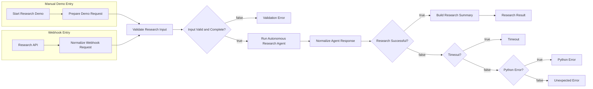
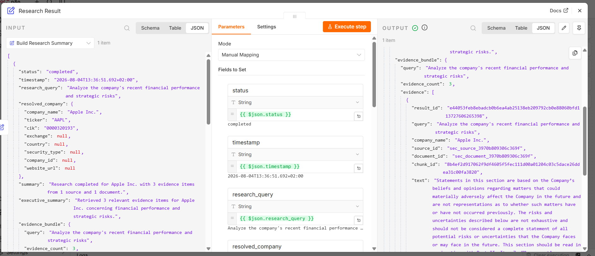

# Autonomous Company Research Agent Workflow

## 1. Overview

The n8n workflow orchestrates the external Python research service that powers the Autonomous Company Research Agent. n8n is used for request entry, deterministic validation, response routing, and presentation-safe formatting. It does **not** duplicate SEC ingestion, OpenAI embeddings, Pinecone access, LangGraph execution, or RAG normalization. Those responsibilities remain in the Python backend.

The overall stack is:

- n8n
- Railway-hosted Python API
- FastAPI
- LangGraph
- SEC EDGAR
- OpenAI embeddings
- Pinecone
- RAG retrieval

## 2. Workflow Purpose

The workflow exists to provide a reliable Ironhack demo path from user input to a readable research result. It supports both manual demo execution and webhook/API execution. Before calling Railway, it validates and normalizes the incoming request, then routes success and failure cases deterministically.

The workflow is intentionally presentation-focused:

- it accepts or defines a company research request;
- it validates the required fields;
- it sends an authenticated `POST` request to Railway;
- it handles success, validation failure, timeout, Python-side failure, and unexpected failure;
- it preserves source attribution and SEC URLs in the final output;
- it avoids exposing secrets or raw provider payloads.

## 3. High-Level Architecture



The manual and webhook entry points converge into the same validation chain. There is no Merge node in the workflow.

### Workflow Screenshot



## 4. Entry Points

### 4.1 Manual Demo Entry

The manual demo path starts with `Start Research Demo`, then `Prepare Demo Request` seeds the Apple demo payload used in the workflow source.

```json
{
  "source": "manual_demo",
  "company": "Apple Inc.",
  "ticker": "AAPL",
  "cik": "0000320193",
  "query": "Analyze the company's recent financial performance and strategic risks"
}
```

### 4.2 Webhook Entry

The webhook path starts with `Research API`, a `POST` webhook at the `company-research` path. `Normalize Webhook Request` accepts either top-level fields or a `body` wrapper and maps them into the canonical request structure. The normalization expressions safely fall back to empty strings when a field is absent, and the later validation node rejects invalid input.

## 5. Input Contract

The canonical request object used by the workflow is:

```json
{
  "source": "manual_demo",
  "company": "Apple Inc.",
  "ticker": "AAPL",
  "cik": "0000320193",
  "query": "Analyze the company's recent financial performance and strategic risks"
}
```

The workflow validates the input as follows:

- `company` must be a non-empty string;
- `ticker` must be a non-empty string;
- `ticker` is normalized to uppercase in the webhook/API layer;
- `cik` must be numeric;
- `cik` is normalized to a 10-digit string in the webhook/API layer;
- `query` must be a non-empty string.

The validation node also derives `company_valid`, `ticker_valid`, `cik_valid`, `query_valid`, `input_valid`, and `normalized_cik`.

## 6. Node-by-Node Reference

| Node | Node Type | Input | Main Responsibility | Output / Branch |
|---|---|---|---|---|
| Start Research Demo | Manual Trigger | None | Starts the manual demo flow | Feeds `Prepare Demo Request` |
| Prepare Demo Request | Set | Manual trigger output | Seeds the Apple demo request | Feeds `Validate Research Input` |
| Research API | Webhook | Incoming `POST` request | Exposes the webhook entry point at `company-research` | Feeds `Normalize Webhook Request` |
| Normalize Webhook Request | Set | Webhook payload | Normalizes top-level or `body` fields into canonical request fields | Feeds `Validate Research Input` |
| Validate Research Input | Set | Canonical request fields | Validates required fields and derives `normalized_cik` and boolean flags | Feeds `Input Valid and Complete?` |
| Input Valid and Complete? | IF | Validation output | Routes valid and invalid requests | True to `Run Autonomous Research Agent`, false to `Validation Error` |
| Validation Error | Set | Invalid input branch | Returns a safe deterministic validation failure object | Terminates the invalid-input branch |
| Run Autonomous Research Agent | HTTP Request | Validated request with normalized CIK | Sends authenticated `POST` to the Railway `/research` endpoint | Feeds `Normalize Agent Response` |
| Normalize Agent Response | Set | HTTP response | Normalizes status code, resolved company, evidence bundle, metrics, and error metadata | Feeds `Research Successful?` |
| Research Successful? | IF | Normalized response | Checks whether the backend response is a valid success payload | True to `Build Research Summary`, false to the error-routing chain |
| Timeout? | IF | Normalized response | Detects timeout-classified failures | True to `Timeout`, false to `Python Error?` |
| Python Error? | IF | Normalized response | Detects Python-classified failures | True to `Python Error`, false to `Unexpected Error` |
| Build Research Summary | Set | Successful normalized response | Builds the presentation-safe summary and Markdown | Feeds `Research Result` |
| Research Result | Set | Summary output | Returns the final success payload | Terminates the success branch |
| Timeout | Set | Timeout branch | Returns a safe timeout error payload | Terminates the timeout branch |
| Python Error | Set | Python branch | Returns a safe backend/Python failure payload | Terminates the Python-error branch |
| Unexpected Error | Set | Fallback branch | Returns a safe unexpected error payload | Terminates the fallback branch |
| Input | Sticky note | Documentation only | Describes input normalization | No runtime effect |
| Validation | Sticky note | Documentation only | Describes validation behavior | No runtime effect |
| Research Agent | Sticky note | Documentation only | Describes the Railway call and Python backend responsibilities | No runtime effect |
| Output | Sticky note | Documentation only | Describes presentation-safe output shaping | No runtime effect |
| Presentation | Sticky note | Documentation only | Describes the demo presentation intent | No runtime effect |
| Architecture | Sticky note | Documentation only | Summarizes the overall flow | No runtime effect |

For the HTTP Request node:

- method: `POST`
- endpoint: `https://autonomous-company-research-agent-production.up.railway.app/research`
- body mapping: `company`, `ticker`, `cik` from `normalized_cik`, and `query`
- authentication: header auth credential named `Autonomous Research Agent API`
- timeout: `120000`
- response handling: `fullResponse: true` and `ignoreResponseCode: true`

## 7. Success Path

The successful sequence is:

`Start Research Demo` or `Research API` → validation → Railway API call → `Normalize Agent Response` → `Research Successful?` true → `Build Research Summary` → `Research Result`

The Python backend returns the canonical research result, and n8n reshapes it into a presentation-safe payload. The backend owns company resolution, embeddings, namespace construction, Pinecone querying, retrieval normalization, evidence assembly, LangGraph execution, and API serialization.

The final workflow output is deterministic and factual. It formats retrieved evidence and metadata; it does not invent unsupported analysis or create an LLM-written executive report.

## 8. Error Routing

### 8.1 Validation Error

Invalid input is rejected before the Railway request is made. The workflow returns a deterministic JSON error with:

- `status: "failed"`
- `stage: "input_validation"`
- `error_code: "INVALID_RESEARCH_REQUEST"`
- `message: "Company, ticker, CIK and research query are required."`

### 8.2 Timeout

Timeout-classified failures route to `Timeout`. The branch returns a safe payload with:

- `status: "failed"`
- `stage: "research_execution"`
- `error_code: "REQUEST_TIMEOUT"`
- `message: "The Python research agent timed out."`
- `http_status: 408`

### 8.3 Python Error

Python-classified failures route to `Python Error`. This branch returns a safe backend-failure payload with:

- `status: "failed"`
- `stage: "research_execution"`
- `error_code: "PYTHON_RESEARCH_ERROR"` or the backend-provided error code
- `message: "The Python research agent returned an error."` or the backend-provided message
- `http_status`: the backend status code

### 8.4 Unexpected Error

Unknown or malformed failures route to `Unexpected Error`. This is the fallback branch for cases that are not classified as validation, timeout, or Python error.

All error outputs are intentionally safe and must not expose API keys, provider payloads, stack traces, or internal secrets.

## 9. Railway API Integration

| Property | Value |
|---|---|
| Method | `POST` |
| Endpoint | `/research` |
| Hosting | Railway |
| Authentication | `X-API-Key` through the n8n Header Auth credential |
| Content type | `application/json` |
| Timeout | `120000 ms` |
| Success response | HTTP `200` with a completed research payload |
| Controlled retrieval failure | HTTP `502` with a safe error payload |

The workflow calls the Railway-hosted Python API with:

- path: `/research`
- method: `POST`
- authentication: `X-API-Key` supplied through the n8n credential reference `Autonomous Research Agent API`
- request body:

```json
{
  "company": "Apple Inc.",
  "ticker": "AAPL",
  "cik": "0000320193",
  "query": "Analyze the company's recent financial performance and strategic risks"
}
```

## 10. Python Backend Responsibilities

n8n orchestrates the demo flow, but it is not the research engine. The Python backend owns:

- company resolution;
- SEC document ingestion and retrieval;
- OpenAI embedding generation;
- Pinecone namespace construction;
- Pinecone vector query;
- metadata normalization;
- evidence assembly;
- LangGraph workflow execution;
- workflow state handling;
- response serialization;
- safe API error mapping.

n8n owns:

- manual and webhook entry points;
- deterministic input validation;
- authenticated API invocation;
- response normalization;
- branch routing;
- presentation-safe output shaping.

## 11. Data Flow

1. A request enters through the manual trigger or webhook trigger.
2. The workflow normalizes the input into `company`, `ticker`, `cik`, and `query`.
3. Validation derives boolean flags and a 10-digit normalized CIK.
4. Invalid input is routed to a deterministic validation error.
5. Valid input is sent to Railway using authenticated `POST /research`.
6. The backend returns either a successful research payload or a safe failure payload.
7. `Normalize Agent Response` extracts the fields needed for branching and presentation.
8. Successful responses flow into `Build Research Summary`.
9. Error responses flow into the timeout, Python error, or unexpected error nodes.
10. The workflow ends with a presentation-safe success object or a safe error object.

## 12. Output Contract

The current success output is presentation-oriented. The backend response that feeds the workflow uses `resolved_company`, `summary`, `executive_summary`, `evidence_bundle`, `sources`, `documents`, and `metrics`. A representative Apple success payload is:

```json
{
  "status": "completed",
  "timestamp": "2026-08-01T12:00:00.000Z",
  "research_query": "Analyze the company's recent financial performance and strategic risks",
  "resolved_company": {
    "company_name": "Apple Inc.",
    "ticker": "AAPL",
    "cik": "0000320193",
    "exchange": null,
    "country": null,
    "security_type": null,
    "company_id": null,
    "website_url": null
  },
  "summary": {
    "evidence_count": 3,
    "source_count": 1,
    "document_count": 1
  },
  "executive_summary": "Apple remains financially resilient while facing concentration and execution risks.",
  "evidence_bundle": {
    "evidence_count": 3,
    "source_count": 1,
    "document_count": 1,
    "evidence": [
      {
        "result_id": "result-1",
        "query": "Analyze the company's recent financial performance and strategic risks",
        "company_name": "Apple Inc.",
        "source_id": "source-1",
        "document_id": "doc-1",
        "chunk_id": "chunk-1",
        "text": "Retrieved SEC evidence excerpt.",
        "similarity_score": 0.482,
        "retrieval_scope": "company:cik:0000320193",
        "source_url": "https://www.sec.gov/Archives/..."
      }
    ]
  },
  "sources": [
    {
      "source_id": "source-1",
      "title": "Apple 10-K",
      "source_url": "https://www.sec.gov/Archives/..."
    }
  ],
  "documents": [
    {
      "document_id": "doc-1",
      "title": "Apple Annual Filing"
    }
  ],
  "metrics": {
    "evidence_count": 3,
    "source_count": 1,
    "document_count": 1
  }
}
```

A current exported workflow may also derive presentation fields such as `company`, `key_evidence`, and `markdown` in the final `Research Result` node. The backend payload above is the canonical research result that the workflow normalizes before presentation.

A representative safe error payload is:

```json
{
  "status": "failed",
  "stage": "research_execution",
  "error_code": "REQUEST_TIMEOUT",
  "message": "The Python research agent timed out.",
  "http_status": 408,
  "errors": {
    "category": "timeout",
    "code": "REQUEST_TIMEOUT",
    "message": "The Python research agent timed out.",
    "http_status": 408
  }
}
```

## 13. Security Design

The workflow keeps secrets out of the exported definition:

- credentials are stored in n8n credentials;
- the workflow references the credential name, not a secret value;
- `X-API-Key` is not hard-coded in the workflow source;
- provider keys remain in Railway environment variables;
- no raw provider payloads, embeddings, or vectors are exposed;
- all branches return safe deterministic messages.

## 14. Design Decisions

| Decision | Rationale |
|---|---|
| n8n for orchestration and visual routing | The workflow needs deterministic branching, a manual demo entry point, and a webhook entry point. |
| Python/FastAPI for provider integrations and backend contracts | The backend already owns SEC, OpenAI, Pinecone, and the RAG execution path. |
| LangGraph for stateful workflow execution | The research pipeline uses an explicit state machine and typed workflow states. |
| Pinecone for company-scoped vector retrieval | The repository already indexes and queries company-scoped vectors there. |
| Railway for HTTPS deployment and environment-variable management | The public API is deployed there and consumes runtime secrets from environment variables. |
| Deterministic final output instead of unsupported generative synthesis | The workflow is presentation-safe and factual, not an additional LLM reporting layer. |
| Shared validation chain for manual and webhook entry points | Both paths normalize into the same request contract before calling the backend. |

## 15. Workflow Features

- [x] manual demo trigger
- [x] webhook entry point
- [x] canonical input normalization
- [x] validation
- [x] CIK normalization
- [x] authenticated Railway request
- [x] safe credential reference
- [x] success routing
- [x] validation error routing
- [x] timeout routing
- [x] Python error routing
- [x] unexpected error routing
- [x] structured final JSON
- [x] preserved SEC source URLs
- [x] support for indexed companies such as Apple and Microsoft

## 16. Demo Scenarios

### Apple Inc.

- ticker: `AAPL`
- CIK: `0000320193`
- expected result: completed workflow with retrieved evidence

### Microsoft Corporation

- ticker: `MSFT`
- CIK: `0000789019`
- expected result: completed workflow with retrieved evidence
- backend alias normalization supports `MICROSOFT CORP` in stored records and `Microsoft Corporation` in the resolved request identity

## 17. Operational Checklist

- Railway service is active
- n8n credential `Autonomous Research Agent API` is configured
- workflow is published in n8n
- Apple demo input is present in `Prepare Demo Request`
- `POST /research` returns `200` for a valid request
- `evidence_count` is nonzero for indexed companies
- SEC source URLs are preserved in the final output
- validation, Python error, timeout, and unexpected branches remain connected
- exported workflow JSON contains no secret values

## 18. Known Limitations

The workflow is retrieval-focused and presentation-oriented. It depends on indexed Pinecone data for nonzero evidence, and it shares one validation chain between the manual and webhook paths. Empty but valid evidence bundles may still complete successfully, and the backend remains responsible for supported filing types and all retrieval logic.

## 19. Related Files

- `n8n/workflows/autonomous_company_research_agent.workflow.json`
- `n8n/workflows/autonomous_company_research_agent.workflow.ts`
- `n8n/README.md`
- `app/api.py`
- `app/n8n_runner.py`
- `app/graph/workflow.py`
- `app/rag/retrieval_service.py`
- `app/rag/normalization.py`
- `tests/unit/test_n8n_workflow_source.py`
